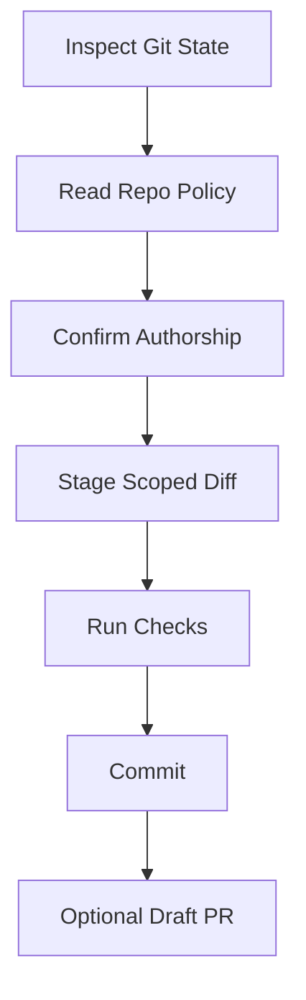

# Commit Changes

Create a local git commit without inventing policy, then open a GitHub draft
pull request when the user asks for one. The repo's own commit and PR
requirements are binding, and the commit must be authored only by the human
user configured in Git.

## Workflow

Track progress through git state, repo policy, authorship, scope, checks,
commit, and optional draft PR creation.



### Step 1: Inspect Git State

Start from the repo root:

```bash
git rev-parse --show-toplevel
git status --short
git status --branch --short
git diff --name-status
git diff --cached --name-status
```

Stop before staging or committing if:

- A merge, rebase, cherry-pick, or revert is in progress and the user did not
  explicitly ask to finish it.
- There are unresolved conflicts.
- The requested commit scope is ambiguous.
- The working tree contains unrelated user changes and you cannot isolate the
  intended files.

When scope is ambiguous, show the proposed file list and ask before staging.

### Step 2: Read Commit And PR Requirements

Before touching the index, look for repo-specific commit and PR rules and read
the matching files. Use both direct file checks and text search:

```bash
rg -n "before commit|pre-commit|commit message|release gate|Conventional|Signed-off|DCO|Co-authored|generated-by|pull request|PR template|draft PR|gh pr create|commit" \
  AGENTS.md CLAUDE.md .claude .codex CONTRIBUTING* README* docs PORTFOLIO.md RELEASE-GATE.md package.json Makefile justfile 2>/dev/null
```

Treat these sources as binding when present:

- Agent memory: `AGENTS.md`, `CLAUDE.md`, `.claude/CLAUDE.md`, `.codex/AGENTS.md`.
- Contributor docs: `CONTRIBUTING*`, `README*`, `docs/`.
- Repo workflow docs: `RELEASE-GATE.md`, `PORTFOLIO.md`, `Makefile`,
  `justfile`, `package.json` scripts.
- Pull request templates: `.github/pull_request_template.md`,
  `.github/PULL_REQUEST_TEMPLATE.md`, `.github/PULL_REQUEST_TEMPLATE/*.md`,
  `docs/pull_request_template.md`, and any template path named by project
  docs.
- Git hooks: `.git/hooks/pre-commit`, `.git/hooks/commit-msg` when readable.

For this plugin marketplace repo, the known commit gate is documented in
`RELEASE-GATE.md` and `PORTFOLIO.md`: run
`scripts/release-gate.sh --mode staged` before committing staged changes.

If multiple PR templates exist and the correct one is not clear from docs or
the user's request, ask which template to use before creating the PR. If docs
conflict, follow the most specific repo-local instruction and mention the
conflict in the final response.

### Step 3: Confirm Human-Only Authorship

Check the configured author and committer before committing:
The `GIT_*` names below are literal Git environment variables, not
placeholders to replace.

```bash
git config user.name
git config user.email
git var GIT_AUTHOR_IDENT
git var GIT_COMMITTER_IDENT
```

Proceed only when the identity is clearly the human user's identity. Stop and
ask the user to configure Git if:

- `user.name` or `user.email` is missing.
- The author or committer looks like an AI, bot, automation account, or tool
  identity.
- `GIT_AUTHOR_*` or `GIT_COMMITTER_*` environment variables override the
  expected user identity.

Do not add, preserve, or suggest any AI attribution. The commit message must
not contain trailers or lines such as:

- `Co-authored-by:`
- `Generated-by:`
- `AI-assisted-by:`
- `Signed-off-by:` for an AI, bot, or tool identity
- Any `Codex`, `Claude`, `OpenAI`, `Anthropic`, or similar tool signature

Do not use `--author` unless the user explicitly provides their own human
author identity for this commit.

### Step 4: Build the Commit Scope

Review the diff before staging:

```bash
git diff --stat
git diff
git diff --cached --stat
git diff --cached
```

Stage only the intended paths:

```bash
git add -- path/to/file path/to/other-file
```

Avoid `git add -A` unless the user explicitly asked to commit all changes and
you have reviewed that full diff. Never stage unrelated local edits just
because they are present.

After staging, re-check:

```bash
git diff --cached --stat
git diff --cached
git diff --cached --check
```

### Step 5: Run Required Checks

Run the checks required by the repo docs after staging and before commit. For
this repo:

```bash
scripts/release-gate.sh --mode staged
```

If the repo has no documented command, at minimum run:

```bash
git diff --cached --check
```

Also run focused tests, linters, type checks, or format checks when the repo's
commit requirements or touched files make them relevant. Do not commit if a
required check fails. Report the failing command and leave the staged state for
the user to inspect unless the user asks you to unstage.

### Step 6: Write the Commit Message

Infer message style from repo rules and recent commits:

```bash
git log -8 --pretty=format:%s
```

Use the user's requested message when provided and valid. Otherwise write a
concise imperative subject that matches local style. Keep body text focused on
what changed and why; do not mention the AI assistant or tooling.

Before committing, check the final message text for forbidden attribution:

```text
Co-authored-by:
Generated-by:
AI-assisted-by:
Codex
Claude
OpenAI
Anthropic
```

### Step 7: Commit and Verify

Commit with standard Git author/committer identity:
Replace `<subject>` with the final commit subject.

```bash
git commit -m "<subject>"
```

For a body, use additional `-m` arguments rather than opening an editor:
Replace `<body>` with the final commit body.

```bash
git commit -m "<subject>" -m "<body>"
```

Never add `--no-verify` unless the user explicitly asks after seeing the
failed or slow hook/check tradeoff. Never amend, force-push, or rewrite
history unless explicitly requested.

After committing, verify the resulting commit:
The `<%ae>` and `<%ce>` fragments below are literal Git pretty-format text,
not placeholders to replace.

```bash
git log -1 --format='%H%n%an <%ae>%n%cn <%ce>%n%B'
git status --short
```

If the resulting message or identity violates the human-only authorship rule,
stop and report it immediately. Do not amend automatically unless the user
explicitly asks.

### Step 8: Create A Draft PR With `gh`

Only create a PR when the user explicitly asks for it. PR creation and branch
pushes are externally visible operations.

Before any push or PR creation, read `../../WORKFLOW-CONTRACTS.md` § External
Contribution Quality Gate and apply it. Stop if the change is speculative,
bundles unrelated fixes, lacks explicit human approval of the complete diff, or
duplicates an open or closed PR.

Check repository and branch state:

```bash
git status --branch --short
git remote -v
gh auth status
gh repo view --json nameWithOwner,defaultBranchRef
gh pr status
```

Stop before creating the PR if:

- The current branch is the default branch.
- The branch has no commit to compare against the base branch.
- Required checks from Step 5 failed or were skipped without user approval.
- `gh auth status` fails.
- A PR already exists for this branch and the user did not ask to update it.

If the branch has not been pushed, push only after the user has asked to create
the PR:

```bash
git push -u origin HEAD
```

Discover and read the PR template:
The `PULL_REQUEST_TEMPLATE` text below is a literal filename pattern, not a
placeholder to replace.

```bash
rg --files .github docs 2>/dev/null | rg '(^|/)(pull_request_template\.md|PULL_REQUEST_TEMPLATE\.md|PULL_REQUEST_TEMPLATE/.*\.md|pull_request_template/.*\.md)$'
```

Search for duplicate open and closed PRs before creating a new one:
Replace `<issue-number-or-title-keywords>` with issue numbers or title terms.

```bash
gh pr list --state all --search "<issue-number-or-title-keywords>" --limit 20 --json number,title,state,url
```

If issue numbers are known, include each one in the search. If no issue number
exists, search title keywords and the touched scope. Stop and report candidate
duplicates instead of opening a PR when any result appears to address the same
problem.

Prepare a temporary body file from the selected template. Fill every required
section with concrete details from the commit, diff, test results, issue links,
and known limitations. Preserve checklists and leave unchecked items unchecked
when they are not satisfied. Do not delete required headings to make the PR look
complete. Mention AI assistance or tool authorship only when the target repo's
PR template or contributor docs require it.

Infer title style from project docs and recent PRs when available:

```bash
gh pr list --state all --limit 10 --json title --jq '.[].title'
```

Create the draft PR with `gh` and a body file:
Replace the angle-bracket placeholders with the chosen base, current branch,
title, and prepared body file.

```bash
gh pr create --draft --base <base-branch> --head <current-branch> --title "<title>" --body-file <body-file>
```

Use `--fill` only if the project has no PR template or the user explicitly asks
for it; templates take precedence over generated summaries. After creation,
verify:

```bash
gh pr view --json url,isDraft,title,body,baseRefName,headRefName
```

If `gh pr create` opens an editor or browser, stop and rerun with explicit
`--title` and `--body-file` flags. Do not convert the PR out of draft unless
the user explicitly asks.

## Final Response

Report:

- Commit SHA and subject.
- Author and committer shown by Git.
- Checks run and their result.
- Draft PR URL and base/head branches when a PR was created.
- PR template path used, or note that no template exists.
- Any files intentionally left unstaged or uncommitted.
- Confirmation that no AI co-author or generated-by trailer was added.

## Related Skills

- `$agent-playbook:vibe-coding-health-check` checks release readiness before committing.
- `$agent-playbook:context-audit` audits repo contribution and agent-context rules.
