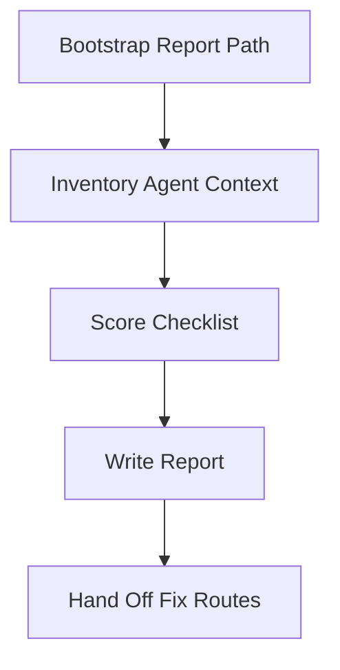

# Context Audit

Find what's wrong with this repo's agent setup — before it bites you mid-
session. Read-only scan + ranked fix list. Cites `../../PRINCIPLES.md` and
`../../WORKFLOW-CONTRACTS.md`.

Read-only means this skill never changes target repo behavior, git state,
GitHub state, hooks, or installed tools. It may write only the documented local
report under `.agent-playbook/<slug>/`.

Apply `../../WORKFLOW-CONTRACTS.md`, including its **Shared Safety And
Evaluation Checklist** section, for the shared output, token, error, and safety
contract; set `truncated: true` if repo-wide inventory caps are hit.

## Arguments

Raw: `$ARGUMENTS`

Parse:
- `--slug <name>` → artifact slug. Default `current`.
- Remaining text → optional focus (`memory`, `tools`, `workflow`,
  `failure-patterns`, or empty for full audit).

## Workflow

Track progress through the inventory, scoring, report, and hand-off steps.



### Step 1: Bootstrap

Replace `<slug>` with the parsed artifact slug before running this example.

```bash
ARTIFACT_DIR=".agent-playbook/<slug>"
mkdir -p "$ARTIFACT_DIR"
```

### Step 2: Inventory

Parallelizable. Gather, don't interpret:

**Memory files**
- `CLAUDE.md`, `.claude/CLAUDE.md`, `AGENTS.md`, `CLAUDE.local.md` —
  existence, line count, last modified.
- `.claude/rules/**/*.md` — count, any with `paths:` frontmatter?
- `~/.claude/CLAUDE.md` if readable — does it override project rules?

**Claude Code config**
- `.claude/settings.json` / `.claude/settings.local.json` — permission
  rules, hooks, allowed MCP, `claudeMdExcludes`.
- `.claude/hooks/` — how many hooks, what events.
- `.claude/skills/**/SKILL.md` — count, check frontmatter
  (`allowed-tools`, `argument-hint`).
- `.claude/agents/*.md` — subagents defined?

**Other tool configs**
- `.cursor/rules/`, `.cursor/commands/`, `.cursor/plans/` — Cursor
  setup.
- `.codex/config.toml`, `.codex/AGENTS.md` — Codex setup.
- `.github/copilot-instructions.md` — Copilot setup.

**Tool sprawl indicators**
- List MCPs configured (from `.mcp.json` or settings).
- List CLIs referenced in CLAUDE.md vs. MCPs — overlap is a smell.

### Step 3: Score against checklist

For each dimension, give one of `✅ ok` / `⚠️ weak` / `❌ broken` plus a
one-line reason. Follow Principles 1–6 and the anti-pattern table in
`PRINCIPLES.md`.

**Memory hygiene** ([Claude Code memory](https://code.claude.com/docs/en/memory))
- [ ] CLAUDE.md exists at project root or `.claude/`
- [ ] Under 200 lines (warn at 150)
- [ ] No self-evident rules ("write clean code", "use good names")
- [ ] Commands are specific (`pnpm test --filter X`) not vague ("test your changes")
- [ ] No architecture dumps (link out instead)
- [ ] No duplication with `.editorconfig`/eslint/prettier
- [ ] `CLAUDE.local.md` is gitignored
- [ ] No contradicting instructions across nested files

**Path-scoped rules** ([Claude Code rules](https://code.claude.com/docs/en/memory#organize-rules-with-claude/rules/))
- [ ] Domain-specific rules live in `.claude/rules/<topic>.md`, not
      stuffed into CLAUDE.md
- [ ] Rules with `paths:` frontmatter actually use glob patterns
- [ ] No duplication between rules/ and CLAUDE.md

**Tool hygiene** ([Anthropic tools](https://www.anthropic.com/engineering/writing-tools-for-agents),
[Peekaboo 2.0](https://steipete.me/posts/2025/peekaboo-2-freeing-the-cli-from-its-mcp-shackles))
- [ ] No MCP duplicates an already-installed CLI (e.g. GitHub MCP
      when `gh` exists)
- [ ] MCPs are namespaced and not overlapping
- [ ] Tool output limits configured where available
- [ ] No more MCPs than the project actually uses

**Verification loop** ([Claude Code best practices](https://code.claude.com/docs/en/best-practices#give-claude-a-way-to-verify-its-work))
- [ ] A test command, a typecheck command, and a lint command are
      *all* present in CLAUDE.md
- [ ] Hooks exist for anything "must happen every time" (e.g.
      format-on-save, block writes to migrations)
- [ ] A `pre-commit` or equivalent chain exists

**Workflow hygiene**
- [ ] Plan-mode is actually used (evidence: `.cursor/plans/`, saved
      Claude Code checkpoints, Codex plan docs)
- [ ] Long tasks use subagents or the `idea-to-ship` flow
- [ ] `/clear` is used between unrelated tasks (hard to audit, but
      ask the user)

**Failure patterns** (retrospective; ask user for 3 recent sessions)
- Any kitchen-sink sessions? Any >3-round corrections on the same
  bug? Any time Claude ignored a CLAUDE.md rule?

### Step 4: Write the report

Write `.agent-playbook/<slug>/context-audit.md` using
`../../templates/context-audit-report.md`. Fill every section in the template;
do not drop the contract line, summary, scorecard, ranked fixes,
noted-but-not-fixing, or next-steps sections.

### Step 5: Hand-off

1. Print the top 3 fixes inline.
2. Never auto-apply fixes in this skill — it's read-only. Point the
   user at `/bootstrap-project-memory` for memory pruning and
   `/tool-review` for tool cleanup.

## Notes

- This skill is **read-only** on the repo. It may write only under
  `.agent-playbook/<slug>/`.
- Be honest. If the setup is already good, say "A — no fixes needed"
  and stop. Do not invent issues.
- If the user asks "is this ready for autonomous agents", grade
  harshly: any ❌ on verification or tool hygiene → "not yet".

## Related Skills

- $agent-playbook:tool-review for detailed review of one tool, CLI, or MCP.
- $agent-playbook:vibe-coding-health-check for lightweight health routing
  before a deeper audit.
- $agent-playbook:bootstrap-project-memory for applying memory-file cleanup
  after this read-only audit.
