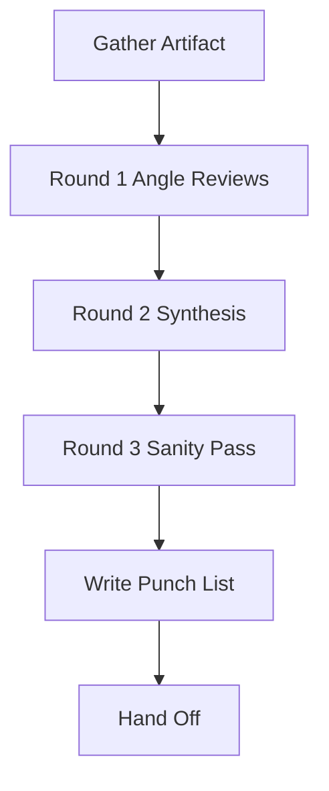

# Tool Review

Review one tool against the tool-writing checklist from
[Anthropic](https://www.anthropic.com/engineering/writing-tools-for-agents),
plus CLI-vs-MCP sanity from [Peekaboo 2.0](https://steipete.me/posts/2025/peekaboo-2-freeing-the-cli-from-its-mcp-shackles).
Cites `../../PRINCIPLES.md` Principle 4 and
`../../WORKFLOW-CONTRACTS.md` for output, token, error, safety, and evaluation
contracts, including the **Shared Safety And Evaluation Checklist** section.

## Arguments

Raw: `$ARGUMENTS`

Parse:
- `--slug <name>` → artifact slug. Default `current`.
- `--review-depth quick|standard|deep` → force review intensity. Without it,
  auto-select by risk from `../../WORKFLOW-CONTRACTS.md`.
- Remaining → the tool. Accepts:
  - A tool name and hand-described behavior (ask for schema in Step 1).
  - A path to an MCP server or its schema (`server.json`, `tools/*.ts`).
  - A path to CLI source (arg parser file, manpage, `README`).
  - An OpenAPI/JSON-schema file describing the tool.

## Multi-Agent Review Routing

This is a review workflow. Apply `../../WORKFLOW-CONTRACTS.md` Review Intensity Selection first.
Invocation is standing authorization to launch
reviewer sub-agents for selected `standard` and `deep`. Run selected `quick` as
a same-context checklist and do not label it degraded. The full deep angles are:

- `BOUNDARIES_NAMES`: purpose, scope, consolidation, namespacing
- `IO_ERRORS_TOKENS`: input schema, output shape, token limits, error clarity
- `EVAL_SAFETY`: CLI-vs-MCP fit, evaluation hooks, safety/read-only claims

Fall back to same-context review only when reviewer sub-agents are explicitly
unsupported by the host/runtime, the user explicitly forbids reviewer
sub-agents, or the selected reviewer/model is explicitly unavailable or at
capacity. If degraded, record `degraded-same-context-review` and the exact
reason. Degraded mode still runs the same angles and rounds sequentially; it
only loses independent agents.

## Workflow

Track review progress by marking each step complete before moving to the next
round.

### Step 1: Gather the artifact

If the user named a tool but didn't point to source, ask **in one batch**:

1. Where does the code live (path or repo)?
2. What's the tool's one-sentence purpose?
3. Is it an MCP tool, a CLI, or a REST endpoint agents call directly?
4. Who calls it — a single agent or multiple?
5. What's a representative successful response payload (sample or size)?
6. What's a representative error?

Then inspect the source/schema **statically** — Read the files, Grep for
the tool definition, read the README or argparse block. **Do not execute
the binary** even for `--help`: running an untrusted binary is arbitrary
code execution, and many CLIs do nontrivial work at import/startup. If
`--help` output is genuinely needed to score this review:

1. First confirm the binary is trusted. Trusted = (a) already installed
   on the user's `PATH` by their package manager, or (b) the user
   explicitly says "yes, I trust this binary".
2. Only then invoke it, and prefer `man <tool>` or a published
   documentation URL over running the binary itself.
3. Never run a binary from a path the user just handed you unless they
   have confirmed it's trusted. "I want to review this unknown tool" is
   exactly the case where running it is wrong.

This skill's promise is read-only on the target tool. Executing the
target breaks that promise.

Apply the shared token budget from `../../WORKFLOW-CONTRACTS.md`. If the tool
schema/source is too large, set `truncated: true`, name the omitted files or
sections, and include the next static inspection command in the hand-off.

### Step 2: Round 1 Angle Reviews

Select `review_intensity` before launching reviewers. Auto-select the smallest
tier that covers the tool risk, or honor `--review-depth quick|standard|deep`
as a forced override. Record `Review intensity: <tier> (<auto|forced>:
<reason>)` in the punch-list.

For `quick`, run one same-context checklist against the scorecard below and
write the ranked punch-list.

For `standard`, launch one reviewer per required angle, in parallel when
supported, then synthesize. Re-check only material findings if the artifact
changes.

For `deep`, launch one reviewer per required angle, in parallel when supported.
Each reviewer scores only its assigned subset using the checklist below. If
degraded, run the same angle prompts sequentially in the main context.

For each checklist item, give `✅ / ⚠️ / ❌` plus a one-line reason.

#### Checklist

**Purpose & boundaries**
- [ ] Single, well-named responsibility. If the name is `process_data`,
      the name is a smell.
- [ ] Does *not* duplicate an existing CLI capability (e.g. a GitHub
      MCP tool that `gh` already does cleanly).
- [ ] Scope is the workflow, not the HTTP call. `schedule_event` beats
      three calls `list_users` + `list_events` + `create_event`.

**Namespacing**
- [ ] Tool name is prefixed by service or resource (`asana_search`,
      `asana_projects_search`).
- [ ] If it's part of a suite, naming is consistent across the suite.

**Inputs**
- [ ] Parameter names are self-describing. `since_iso8601` beats `since`.
- [ ] Required vs. optional is explicit and minimal.
- [ ] Descriptions for each parameter include a concrete example in
      the expected format.
- [ ] Defaults exist for optional params; no surprise required behavior.

**Outputs**
- [ ] Returns natural-language identifiers where possible (not just
      UUIDs).
- [ ] Token-efficient: pagination, filter, or a `response_format` enum
      (`concise|detailed`).
- [ ] Hard size cap. Anthropic caps Claude Code tool responses at 25k
      tokens; document your cap.
- [ ] Structure is predictable across success and partial-success.

**Errors**
- [ ] Error messages are a sentence the agent can act on, not an
      opaque code.
- [ ] Retryable vs. terminal errors are distinguishable (field or
      status).
- [ ] No silent truncation — if the tool truncated, it says so.

**CLI-vs-MCP sanity**
- [ ] If this is an MCP, does an existing CLI already do it? If yes,
      justify the MCP (stateful protocol, browser automation, etc.)
      or recommend dropping it.
- [ ] MCP permanently occupies context; CLIs don't. Justify the cost.

**Evaluation hooks**
- [ ] There's a realistic multi-step eval / fixture the tool is tested
      against (not just unit tests of the underlying function).
- [ ] Agent reasoning transcripts have been reviewed for confusion
      points (per Anthropic's evaluation-driven process).

### Step 3: Round 2 Synthesis + Round 3 Sanity Pass

Synthesize the available outputs into one ranked punch-list. For `deep`, run a
final sanity pass against the source/schema to catch dropped severe findings,
duplicate findings, or unsupported claims. For `standard`, run the sanity pass
only when reviewers disagreed or a severe finding is near a boundary decision.
If the final pass finds a material miss, update the punch-list and record the
pass as Round 3.

### Step 4: Write the punch-list

Write `.agent-playbook/<slug>/tool-review-<tool-name>.md` using
`../../templates/tool-review-report.md`. Fill every section in the template;
do not drop the contract line, review rounds, scorecard, ranked fixes, kill
candidates, or keep-as-is sections.

### Step 5: Hand-off

1. Print the top 3 fixes + any kill candidates inline.
2. If this tool is part of a larger set, suggest running `/tool-review`
   on a few more and aggregating — sprawl shows up across tools, not
   within one.

## Notes

- **Read-only on the tool's source.** This skill never edits tool code;
  it writes only under `.agent-playbook/<slug>/`.
- **Review mode matters.** Do not call same-context output independent
  multi-agent review. Same-context is a recorded degradation only for explicit
  unsupported runtime, user-forbidden delegation, or reviewer/model
  unavailable/capacity cases.
- **Be blunt.** If the tool should not exist, say so. "Already covered
  by `gh pr view`" is a valid verdict.
- **Don't grade tools on what they can't fix.** If an MCP wraps a
  vendor API with opaque error codes, note it but don't penalize the
  wrapper author; the score belongs to the vendor.
- For evaluating a *suite* of tools (surface-area, overlap), use
  `/context-audit` with `focus tools` instead.

## Related Skills

- $agent-playbook:context-audit for suite-level tool and context sprawl.
- $agent-playbook:vibe-coding-health-check for lightweight routing before a
  deeper review.
