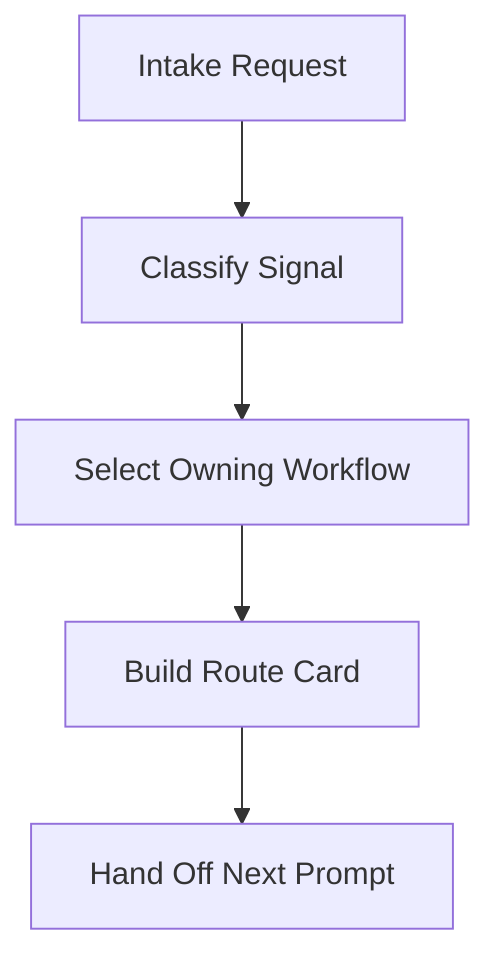

# Workflow Router

Select the owning workflow and produce a route card the user or next agent can
run. This skill does not replace downstream skills; it chooses the sequence and
names the boundary before any mutating work starts.

Read `../../PRINCIPLES.md` and `../../WORKFLOW-CONTRACTS.md` when the request
has unclear ownership, mutation risk, or mixed signals. Apply the local
12-rule execution contract: state assumptions, prefer the narrow owner, surface
conflicts, and fail loud when routing cannot be decided from the prompt.

## Arguments

Raw: `$ARGUMENTS`

Parse the request as free-form workflow intent. Inputs may be a feature idea,
bug report, GitHub issue/PR, review request, repo hygiene concern, tool audit,
resilience concern, secret-scan request, stale-worktree cleanup, or commit/PR
readiness question.

## Workflow

Track progress through intake, classification, route selection, route-card
output, and hand-off.



### Step 1: Intake

1. Capture the user's stated goal, artifact or URL references, and any
   requested constraints.
2. Identify whether the request is asking for advice only or for work that
   would change files, tests, git state, GitHub, hooks, credentials, or
   external systems.
3. If the user asks the router to execute a downstream workflow, stop and give
   the route card plus the exact next prompt instead. The user must invoke the
   owner directly.

### Step 2: Classify Signals

Use the most specific matching route. If several signals are present, sequence
the narrow owner first and put safety/review/commit steps after it.

| Signal | Owning workflow |
|---|---|
| New product idea, feature, fuzzy requirement, UX, or implementation plan | `idea-to-ship:brainstorm` sequence |
| Monetization, ICP, pricing, packaging, or roadmap prioritization | `idea-to-ship:commercialize` then `idea-to-ship:roadmap` |
| GitHub issue, issue number, or concrete bug | `issue-evaluator:evaluate-issue` |
| Review an existing local fix or current diff | `issue-evaluator:review-fix` |
| GitHub PR review or reviewer-comment handling | `issue-evaluator:review-pr` or `issue-evaluator:fix-pr-comments` |
| PR or repo-specific style-rule drift | `issue-evaluator:update-code-style` |
| Create or refine repo memory such as `CLAUDE.md` or `AGENTS.md` | `agent-playbook:bootstrap-project-memory` |
| Audit repo memory, context hygiene, MCP/tool sprawl, or fast-coding drift | `agent-playbook:context-audit` or `agent-playbook:vibe-coding-health-check` by intent |
| One tool, CLI, MCP server, REST endpoint, or schema surface | `agent-playbook:tool-review` |
| Agent/plugin/hook/skill fragility, state pollution, or recovery gaps | `antifragile:antifragile-agent` |
| Target app/system resilience, dependency fallback, data safety, or observability | `antifragile:antifragile-system` |
| New agent harness design | `harness-engineering:harness-design` |
| Existing harness, autonomous agent, or pipeline audit | `harness-engineering:harness-audit` |
| Long-horizon checkpointed execution loop | `harness-engineering:goal-mode` |
| Context reset or memory consolidation routine | `harness-engineering:resilience-plan` |
| Generator/evaluator success contract | `harness-engineering:sprint-contract` |
| Broad harness request without enough intent to choose one skill | `needs_clarification` |
| Credential leak scan or secret audit | `secret-scanner:scan-secrets` |
| Install or enforce secret scanning through a pre-commit hook | `secret-scanner:install-precommit-hook` |
| Stale git worktrees after PR merge/closure | `worktree-cleaner:clean-worktrees` |
| Finished diff needs a local commit or draft PR | `agent-playbook:commit-changes` |

### Step 3: Route Catalog

Use these canonical sequences unless the user's request narrows the scope.

**Feature / product delivery**
- `$idea-to-ship:brainstorm`
- Optional `$idea-to-ship:commercialize`
- `$idea-to-ship:architect`
- `$idea-to-ship:review-design`
- Optional `$idea-to-ship:ui-design`
- `$idea-to-ship:tdd`
- `$idea-to-ship:implement`
- `$idea-to-ship:test`
- Optional `$idea-to-ship:visual-test`
- `$idea-to-ship:review-code`
- `$agent-playbook:commit-changes`

Use `$idea-to-ship:review-code` only for an idea-to-ship artifact-backed
implementation diff. Do not use it as the generic bug-fix reviewer.

**Issue / concrete bug**
- `$issue-evaluator:evaluate-issue`
- `$issue-evaluator:fix-issue`
- `$issue-evaluator:review-fix`
- `$agent-playbook:commit-changes`

Use `$issue-evaluator:review-fix` only for issue, bug-fix, or reviewer-comment
diffs. If the user wants no commit from the fixing step, state that constraint
in `required_inputs` and `next_prompt` so the owner can apply it explicitly.
If the user only asks to review an existing local fix or current diff, route
directly to `$issue-evaluator:review-fix`.

**Pull request**
- Review only: `$issue-evaluator:review-pr`
- Address reviewer comments: `$issue-evaluator:fix-pr-comments`
- Style rule drift: `$issue-evaluator:update-code-style`

**Agent, context, and tool governance**
- Repo context or suite-level tool sprawl: `$agent-playbook:context-audit`
- One tool/CLI/MCP surface: `$agent-playbook:tool-review`
- Fast AI-coded diff control check: `$agent-playbook:vibe-coding-health-check`
- Apply bounded health-check cleanup only after authorization:
  `$agent-playbook:vibe-coding-fix`

Use `$agent-playbook:tool-review` only for a single tool surface. Use
`$agent-playbook:context-audit` for suite-level memory, rules, hooks, MCPs, and
tool bloat.

**Resilience and safety**
- Agent/plugin infrastructure fragility: `$antifragile:antifragile-agent`
- Target system resilience: `$antifragile:antifragile-system`
- New harness design: `$harness-engineering:harness-design`
- Existing harness or autonomous-agent audit:
  `$harness-engineering:harness-audit`
- Long-horizon checkpointed execution loop:
  `$harness-engineering:goal-mode`
- Context reset or memory consolidation:
  `$harness-engineering:resilience-plan`
- Generator/evaluator success contract:
  `$harness-engineering:sprint-contract`
- Broad harness request without enough intent: return
  `recommended_workflow: needs_clarification`
- Secret scan or leak audit: `$secret-scanner:scan-secrets`
- Secret-scanning hook install or enforcement:
  `$secret-scanner:install-precommit-hook`
- Worktrees: `$worktree-cleaner:clean-worktrees`

### Step 4: Output Route Card

Always answer with exactly one primary route card. Add a short note only when
multiple routes are plausible or a stop condition needs explanation.

```yaml
recommended_workflow: <plugin-qualified skill or ordered workflow name>
steps:
  - <plugin-qualified skill invocation or named phase>
required_inputs:
  - <issue URL, slug, PR number, artifact, focus, approval, or "none">
mutation_points:
  - <which steps write artifacts, tests, code, git, GitHub, hooks, or none>
stop_conditions:
  - <missing requirement, unsafe mutation, ambiguous owner, failed gate, or none>
next_prompt: "<copy-paste prompt for the next skill>"
assumptions:
  - <only when a safe default was chosen from ambiguous input>
clarifying_questions:
  - <only when no safe default exists; at most three questions>
```

For `next_prompt`, use plugin-qualified names such as
`$idea-to-ship:brainstorm --slug <slug> ...` or
`$agent-playbook:context-audit --slug <slug> focus`.

For clarification-only route cards, use `recommended_workflow:
needs_clarification`, `mutation_points: [none]`, `stop_conditions:
[ambiguous owner]`, and a sanitized router re-entry prompt. Never copy
secret-like user input into `required_inputs` or `next_prompt`; refer to
redacted secret material or affected paths instead.

### Route Card Examples

```yaml
scenario_id: feature-idea
intent: "Turn a fuzzy product idea into requirements and an implementation path."
recommended_workflow: "$idea-to-ship:brainstorm"
steps:
  - "$idea-to-ship:brainstorm"
  - "$idea-to-ship:architect"
  - "$idea-to-ship:review-design"
  - "$idea-to-ship:tdd"
  - "$idea-to-ship:implement"
  - "$idea-to-ship:test"
  - "$idea-to-ship:review-code"
required_inputs:
  - "slug and initial product idea"
mutation_points:
  - "idea-to-ship artifacts, tests, and implementation files in downstream steps"
stop_conditions:
  - "missing slug or unclear product goal"
next_prompt: "$idea-to-ship:brainstorm --slug <slug>"
```

```yaml
scenario_id: commercial-roadmap
intent: "Analyze monetization, ICP, pricing, packaging, and roadmap priority."
recommended_workflow: "$idea-to-ship:commercialize"
steps:
  - "$idea-to-ship:commercialize"
  - "$idea-to-ship:roadmap"
required_inputs:
  - "slug, product idea, and candidate market context"
mutation_points:
  - "idea-to-ship commercial and roadmap artifacts"
stop_conditions:
  - "missing slug or commercialization goal"
next_prompt: "$idea-to-ship:commercialize --slug <slug>"
```

```yaml
scenario_id: github-issue-bug
intent: "Evaluate and fix a GitHub issue or concrete bug report."
recommended_workflow: "$issue-evaluator:evaluate-issue"
steps:
  - "$issue-evaluator:evaluate-issue"
  - "$issue-evaluator:fix-issue"
  - "$issue-evaluator:review-fix"
required_inputs:
  - "issue URL, issue number, or concrete bug description"
mutation_points:
  - "fix-issue may write code in an isolated worktree"
stop_conditions:
  - "missing issue URL, issue number, or reproducible bug description"
next_prompt: "$issue-evaluator:evaluate-issue <issue URL or bug description>"
```

```yaml
scenario_id: pr-review
intent: "Review an existing pull request without applying fixes."
recommended_workflow: "$issue-evaluator:review-pr"
steps:
  - "$issue-evaluator:review-pr"
required_inputs:
  - "PR URL or number"
mutation_points:
  - "none"
stop_conditions:
  - "none"
next_prompt: "$issue-evaluator:review-pr <PR URL or number>"
```

```yaml
scenario_id: pr-reviewer-comments
intent: "Triage and address reviewer comments on a pull request."
recommended_workflow: "$issue-evaluator:fix-pr-comments"
steps:
  - "$issue-evaluator:fix-pr-comments"
required_inputs:
  - "PR URL or number and explicit approval before edits"
mutation_points:
  - "local code edits only after approval"
stop_conditions:
  - "missing approval to edit files"
next_prompt: "$issue-evaluator:fix-pr-comments <PR URL or number>"
```

```yaml
scenario_id: secret-scan
intent: "Scan changed files for leaked credentials."
recommended_workflow: "$secret-scanner:scan-secrets"
steps:
  - "$secret-scanner:scan-secrets"
required_inputs:
  - "scan mode or scope"
mutation_points:
  - "none"
stop_conditions:
  - "none"
next_prompt: "$secret-scanner:scan-secrets --mode staged"
```

```yaml
scenario_id: secret-hook-install
intent: "Install or enforce secret scanning through a pre-commit hook."
recommended_workflow: "$secret-scanner:install-precommit-hook"
steps:
  - "$secret-scanner:install-precommit-hook"
required_inputs:
  - "framework choice and overwrite approval"
mutation_points:
  - "local hook/config files"
stop_conditions:
  - "missing approval for hook overwrite"
  - "unsafe overwrite state"
next_prompt: "$secret-scanner:install-precommit-hook --framework native --abort-on-findings"
```

```yaml
scenario_id: style-rule-drift
intent: "Update repo-specific style guidance after PR review drift."
recommended_workflow: "$issue-evaluator:update-code-style"
steps:
  - "$issue-evaluator:update-code-style"
required_inputs:
  - "source review comments or representative repo files"
mutation_points:
  - "code style guide artifact"
stop_conditions:
  - "missing source evidence for style drift"
next_prompt: "$issue-evaluator:update-code-style"
```

```yaml
scenario_id: bootstrap-repo-memory
intent: "Create or refine project memory such as CLAUDE.md or AGENTS.md."
recommended_workflow: "$agent-playbook:bootstrap-project-memory"
steps:
  - "$agent-playbook:bootstrap-project-memory"
required_inputs:
  - "repo context and approval for memory-file edits"
mutation_points:
  - "CLAUDE.md and AGENTS.md"
stop_conditions:
  - "missing approval to create or rewrite memory files"
next_prompt: "$agent-playbook:bootstrap-project-memory"
```

```yaml
scenario_id: context-audit-tool-sprawl
intent: "Audit repo memory, context hygiene, MCP/tool sprawl, or fast-coding drift."
recommended_workflow: "$agent-playbook:context-audit"
steps:
  - "$agent-playbook:context-audit"
required_inputs:
  - "target repo or focus area"
mutation_points:
  - "local report artifact"
stop_conditions:
  - "none"
next_prompt: "$agent-playbook:context-audit --slug <slug>"
```

```yaml
scenario_id: single-tool-review
intent: "Review one tool, CLI, MCP server, REST endpoint, or schema surface."
recommended_workflow: "$agent-playbook:tool-review"
steps:
  - "$agent-playbook:tool-review"
required_inputs:
  - "tool name and target files or docs"
mutation_points:
  - "local report artifact"
stop_conditions:
  - "missing tool name or surface"
next_prompt: "$agent-playbook:tool-review --slug <slug> <tool name>"
```

```yaml
scenario_id: vibe-health-check
intent: "Run a fast health check on a repo or current AI-coded diff."
recommended_workflow: "$agent-playbook:vibe-coding-health-check"
steps:
  - "$agent-playbook:vibe-coding-health-check"
required_inputs:
  - "target repo, current diff, or focus area"
mutation_points:
  - "local report artifact"
stop_conditions:
  - "none"
next_prompt: "$agent-playbook:vibe-coding-health-check --slug <slug>"
```

```yaml
scenario_id: antifragile-agent-audit
intent: "Audit agent, plugin, hook, or skill infrastructure fragility."
recommended_workflow: "$antifragile:antifragile-agent"
steps:
  - "$antifragile:antifragile-agent"
required_inputs:
  - "agent/plugin/hook/skill target"
mutation_points:
  - "none"
stop_conditions:
  - "none"
next_prompt: "$antifragile:antifragile-agent"
```

```yaml
scenario_id: antifragile-system-audit
intent: "Audit target application resilience, fallback, data safety, or observability."
recommended_workflow: "$antifragile:antifragile-system"
steps:
  - "$antifragile:antifragile-system"
required_inputs:
  - "target application or subsystem"
mutation_points:
  - "none"
stop_conditions:
  - "none"
next_prompt: "$antifragile:antifragile-system"
```

```yaml
scenario_id: harness-design
intent: "Design a new autonomous-agent harness."
recommended_workflow: "$harness-engineering:harness-design"
steps:
  - "$harness-engineering:harness-design"
required_inputs:
  - "slug, agent objective, and operating constraints"
mutation_points:
  - ".harness-engineering artifact"
stop_conditions:
  - "missing slug or agent objective"
next_prompt: "$harness-engineering:harness-design --slug <slug>"
```

```yaml
scenario_id: harness-audit
intent: "Audit an existing harness, autonomous agent, or pipeline."
recommended_workflow: "$harness-engineering:harness-audit"
steps:
  - "$harness-engineering:harness-audit"
required_inputs:
  - "target harness, agent, or pipeline"
mutation_points:
  - ".harness-engineering artifact"
stop_conditions:
  - "missing target harness"
next_prompt: "$harness-engineering:harness-audit --slug <slug>"
```

```yaml
scenario_id: goal-mode
intent: "Run long-horizon work through a checkpointed goal loop."
recommended_workflow: "$harness-engineering:goal-mode"
steps:
  - "$harness-engineering:goal-mode"
required_inputs:
  - "concrete objective and checkpoint policy"
mutation_points:
  - "goal state"
stop_conditions:
  - "missing objective"
next_prompt: "$harness-engineering:goal-mode"
```

```yaml
scenario_id: resilience-plan
intent: "Design context reset or memory consolidation routines."
recommended_workflow: "$harness-engineering:resilience-plan"
steps:
  - "$harness-engineering:resilience-plan"
required_inputs:
  - "slug and target long-horizon agent"
mutation_points:
  - ".harness-engineering artifact"
stop_conditions:
  - "missing slug or target routine"
next_prompt: "$harness-engineering:resilience-plan --slug <slug>"
```

```yaml
scenario_id: sprint-contract
intent: "Draft a generator/evaluator success contract."
recommended_workflow: "$harness-engineering:sprint-contract"
steps:
  - "$harness-engineering:sprint-contract"
required_inputs:
  - "generator role, evaluator role, and success criteria"
mutation_points:
  - ".harness-engineering artifact"
stop_conditions:
  - "missing success criteria"
next_prompt: "$harness-engineering:sprint-contract --slug <slug>"
```

```yaml
scenario_id: local-fix-review
intent: "Review my existing local fix before I commit."
recommended_workflow: "$issue-evaluator:review-fix"
steps:
  - "$issue-evaluator:review-fix"
required_inputs:
  - "current local diff"
mutation_points:
  - "none"
stop_conditions:
  - "none"
next_prompt: "$issue-evaluator:review-fix"
```

```yaml
scenario_id: harness-ambiguous
intent: "I need help with harness work, but I have not said design, audit, goal mode, resilience, or sprint contract."
recommended_workflow: needs_clarification
steps:
  - "ask clarifying questions"
required_inputs:
  - "user answers to clarifying_questions"
mutation_points:
  - "none"
stop_conditions:
  - "ambiguous owner"
next_prompt: "$agent-playbook:workflow-router <redacted original request plus answers>"
clarifying_questions:
  - "Is this a new harness design, an audit of an existing harness, a long-running goal loop, a resilience routine, or a sprint contract?"
```

```yaml
scenario_id: ambiguous-secret-concern
intent: "A user reports a vague secret concern without install, hook, or enforcement wording."
recommended_workflow: "$secret-scanner:scan-secrets"
steps:
  - "$secret-scanner:scan-secrets"
required_inputs:
  - "affected file/path/ref, with secret material redacted"
mutation_points:
  - "none"
stop_conditions:
  - "none"
next_prompt: "$secret-scanner:scan-secrets --mode working"
assumptions:
  - "No hook-install wording was present, so choose the read-only scanner as the safe default."
```

```yaml
scenario_id: worktree-cleanup
intent: "Clean up stale git worktrees after PR merge or closure."
recommended_workflow: "$worktree-cleaner:clean-worktrees"
steps:
  - "$worktree-cleaner:clean-worktrees"
required_inputs:
  - "target repo and optional --apply approval"
mutation_points:
  - "worktree removal only if --apply is approved"
stop_conditions:
  - "missing --apply approval for removal"
next_prompt: "$worktree-cleaner:clean-worktrees"
```

```yaml
scenario_id: commit-handoff
intent: "Prepare a finished local diff for commit or draft PR."
recommended_workflow: "$agent-playbook:commit-changes"
steps:
  - "$agent-playbook:commit-changes"
required_inputs:
  - "intended diff scope and commit/PR approval"
mutation_points:
  - "git commit and optional draft PR"
stop_conditions:
  - "missing approval to commit or open a draft PR"
next_prompt: "$agent-playbook:commit-changes"
```

```yaml
scenario_id: secret-redaction
intent: "A user mentions scanner-safe fake secret-shaped material that must not be echoed."
recommended_workflow: "$secret-scanner:scan-secrets"
steps:
  - "$secret-scanner:scan-secrets"
required_inputs:
  - "affected file/path/ref with redacted secret material"
mutation_points:
  - "none"
stop_conditions:
  - "none"
next_prompt: "$secret-scanner:scan-secrets --mode working"
assumptions:
  - "Do not copy secret-like values into the route card; route to scanning with redacted secret material."
```

### Step 5: Boundaries

- Conversation-only: do not write route artifacts.
- Read-only on target code and tools: do not edit files, run fixes, stage,
  commit, push, open PRs, post GitHub comments, remove worktrees, install hooks,
  rotate secrets, or change plugin/runtime configuration.
- Safe inspection is allowed only when needed to disambiguate routing; keep it
  bounded and report skipped inspection.
- If the request is ambiguous, ask at most three short questions. If a
  reasonable default exists, choose it and list the assumption in the route
  card.

## Hygiene Exception

moderate-skill-bloat: Route-card examples remain in this SKILL.md because the
deterministic fixtures parse the same artifact as the public route catalog to
catch catalog/example drift.

## Related Skills

- `$agent-playbook:vibe-coding-health-check` for scoring a current diff or repo
  after fast AI-assisted work.
- `$agent-playbook:context-audit` for suite-level context, memory, hook, MCP,
  and tool-sprawl audits.
- `$agent-playbook:tool-review` for one tool, CLI, MCP server, REST endpoint,
  or schema.
- `$idea-to-ship:brainstorm` for the first artifact in a new feature flow.
- `$issue-evaluator:evaluate-issue` for diagnosis of a GitHub issue or concrete
  bug description.
