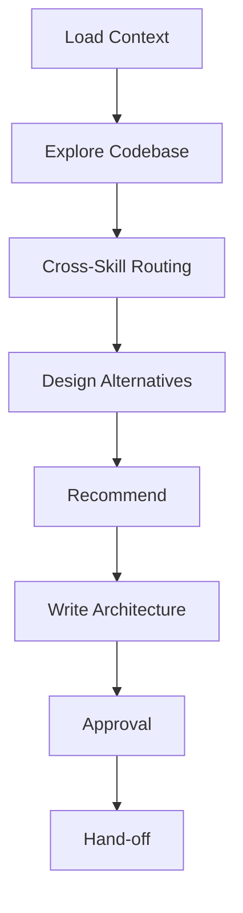

# Architect — Design From Requirements

Turn `requirements.md` into a concrete architecture. The output is a document an implementer could pick up and build from without re-deriving any decisions. Multiple alternatives are explored so the tradeoffs are visible, not hidden.

## Arguments

Raw: `$ARGUMENTS`

Parse:
- Optional leading `--slug <name>`. Default slug: `current`.
- Remaining text → extra design notes / constraints the user wants honored.

## Workflow

Track progress with a visible checklist and update it after context load,
codebase exploration, routing, alternatives, recommendation, approval, and
handoff.



### Step 1: Load Context

1. Resolve artifact dir `.idea-to-ship/<slug>/`.
2. Require `requirements.md` to exist. If it doesn't, stop and tell the user to run `/brainstorm --slug <slug>` first.
3. Read `requirements.md` fully.
4. Read `interface-design.md` if present. Treat it as UI/UX and visual-system
   context that the technical design must preserve for user-facing surfaces.
5. Read `../../WORKFLOW-CONTRACTS.md`, especially **Cross-Skill Routing** and
   **Human Approval Routing**. Apply § Idea Intake Reality Gate before
   designing.
6. If `architecture.md` already exists, read it fully. This run is a revision
   unless the user explicitly approves starting over.

### Step 1.5: Architecture Ownership

`architecture.md` is the canonical design contract for this slug. `/architect`
owns its generated structure, but humans may have edited tradeoffs, risks,
open questions, or staged implementation notes between runs.

On rerun:

1. Preserve stable requirement references, option names, stage names, and any
   existing decision history unless the source requirements changed.
2. Update known sections by heading instead of rewriting the whole file.
3. Preserve human notes, manually accepted tradeoffs, unresolved risks, and
   prior review findings.
4. If the existing file cannot be safely merged because it lacks the expected
   headings or contains unstructured human content, write
   `architecture.draft.md` or use `../../WORKFLOW-CONTRACTS.md` § Human
   Approval Routing before replacing `architecture.md`.
5. If the user asks to start over, summarize what will be discarded and obtain
   explicit approval through `../../WORKFLOW-CONTRACTS.md` § Human Approval
   Routing before replacing the canonical file.

### Step 2: Explore the Codebase

Use a runtime-native explorer sub-agent only when the host permits sub-agents
and the current user/host policy authorizes delegation. In Claude Code, use the
**Agent tool with `subagent_type: "Explore"`** with thoroughness `medium` when
authorized. In non-Claude runtimes, use the host's native sub-agent mechanism
with role `EXPLORER` when authorized. Otherwise, run a separate main-context
exploration pass with the same questions and record the fallback in
`architecture.md` under Codebase Context. Ask:

- What are the existing modules/packages most relevant to the touch points in `requirements.md`?
- What layering conventions does this repo follow (e.g. handler/service/repo split, domain events, hexagonal, etc)?
- What tech stack constraints apply (frameworks, DI style, async model, DB, testing libraries)?
- Are there existing utilities or abstractions we should reuse instead of reinventing?

Ask for a concise report with file paths. Do not proceed without this grounding — the design must fit the codebase, not an imagined one.

### Step 2.5: Cross-Skill Architecture Routing

Apply `../../WORKFLOW-CONTRACTS.md` § Cross-Skill Routing. Route only on
concrete signals from `requirements.md`, `interface-design.md`, or codebase
exploration:

- Agent/pipeline/harness/state/evaluator/tool-output risks → run or recommend
  `harness-engineering:harness-design` or
  `harness-engineering:sprint-contract`.
- Multi-context, checkpoint, resume, handoff, or memory-consolidation risks →
  run or recommend `harness-engineering:resilience-plan` or
  `harness-engineering:goal-mode`.
- External dependency, data safety, irreversible side effect, fallback,
  observability, or recovery risks → run or recommend
  `antifragile:antifragile-system`.
- Secrets, credentials, signing keys, auth config, webhooks, or generated
  examples → add secret-storage/redaction/no-hardcoded-secret constraints; run
  `secret-scanner:scan-secrets` only if files already changed.

Record every route in `architecture.md` under `## Cross-Skill Routing` with:

```markdown
| Signal | Routed skill | Result | Design impact |
|---|---|---|---|
| ... | ... | ... | ... |
```

If no route is triggered, write one row: `None | none | no cross-skill signal
found | none`.

### Step 3: Design — Multiple Alternatives

Enumerate **2–3 realistic approaches**. Do not invent a straw-man just to crown the favorite. Each approach must be something a sane engineer would actually build.

For each alternative, think through:

- Module boundaries — what gets created, what gets modified, what stays.
- Data flow — control + data from entry point to side effect.
- Data model / schema changes, if any.
- Public interfaces (function signatures, API shapes, event schemas).
- Failure handling — what can go wrong, where, and who handles it.
- Migration / rollout path — how does this land without breaking existing users?
- Test strategy implications — what will be unit-testable vs integration-only.

Then for each: **Pros**, **Cons**, **Risk**.

### Step 4: Recommend

Pick one. State the recommendation plainly in the first sentence of the section. Justify based on:

- Fit with the existing codebase (cite files).
- Blast radius (smallest that meets the requirements wins).
- Reversibility (is this easy to undo if wrong?).
- Tradeoffs accepted explicitly.

**Do not hedge.** If two options are genuinely equivalent, say so and state the tiebreaker.

### Step 5: Write `architecture.md`

Template:

```markdown
# Architecture — <short title>

**Slug:** <slug>
**Date:** <YYYY-MM-DD>
**Status:** draft
**Approval:** pending
**References:** requirements.md, interface-design.md (if present)

## Summary
<One paragraph. What we're building and the chosen approach in plain English.>

## Goals / Non-Goals
Pull from requirements.md; restate in design-relevant terms.

## Codebase Context
<Key existing modules this will touch, with file paths. Conventions we must honor.>

## Cross-Skill Routing
| Signal | Routed skill | Result | Design impact |
|---|---|---|---|
| ... | ... | ... | ... |

## Alternatives Considered

### Option A — <name>
<Description.>

**Module changes:** <files/packages>
**Data flow:** <sketch>
**Interfaces:** <key signatures>
**Pros:** ...
**Cons:** ...
**Risk:** ...

### Option B — <name>
...

### Option C — <name> (optional)
...

## Recommendation
**We pick Option <X>.** <2–3 sentences why.>

## Chosen Design — Detail

### Module Breakdown
- `path/to/new_module.ext` — <role>
- `path/to/existing.ext` — <modification>

### Data Flow
<Diagram-in-prose or ASCII. Who calls whom, what goes over the wire.>

### Interfaces
<Concrete signatures, API routes, event schemas. Be specific enough to implement.>

### Data / Schema Changes
<DDL, migrations, or "none">

### Failure Modes & Handling
- <scenario>: <behavior>

### Rollout / Migration
<How it ships without breaking prod. Feature flag? Backfill? Dual-write?>

### Test Strategy Hooks
<Seams that make testing easy. What will be unit-testable, what needs integration.>

## Staged Implementation Plan
Ordered, independently-shippable stages. Each stage should leave the system working.

1. **Stage 1 — <name>**: <what lands, what doesn't yet>
2. **Stage 2 — <name>**: ...
3. **Stage 3 — <name>**: ...

## Open Questions
<Things the design cannot settle without more info. Answers go here before /implement runs.>
```

### Step 5.5: Architecture Approval

Apply `../../WORKFLOW-CONTRACTS.md` § Human Approval Routing to
`architecture.md` before hand-off.

- If a Plannotator gate is available, use it to approve `architecture.md`.
  Prefer `plannotator annotate .idea-to-ship/<slug>/architecture.md
  --render-html --gate` when rendered proposal review is supported; otherwise
  use `plannotator annotate .idea-to-ship/<slug>/architecture.md --gate`.
- If current-conversation bypass is active, skip the Plannotator gate and
  record `**Approval:** bypassed-current-conversation`.
- If denied, revise from Plannotator feedback and re-gate. Stop with
  `needs_user` if the denial changes product scope or conflicts with
  `requirements.md`.
- Record approval source, date, decision, and any denial/revision summary in
  the `**Approval:**` field or a short `## Approval History` section.
- If Plannotator is unavailable, leave `**Approval:** pending` and ask the
  user directly only when an approval decision is needed before continuing.

### Step 6: Hand-off

1. Print a 5-bullet summary: chosen option, top tradeoff accepted, top risk,
   routed cross-skill checks, first stage, any open questions.
2. Tell the user: "Run `/review-design` next — the runtime-aware adversarial reviewer will tear this apart and we'll iterate."

## Anti-Patterns

Recognize and avoid these — they are the most common failure modes in this skill:

- **Straw-man alternatives.** Inventing a deliberately weak option to make the favorite look good. Every alternative must be something a sane engineer would actually build. If you catch yourself writing an option just to fill the "2-3 alternatives" requirement, stop — two real options beat three where one is a prop.
- **Premature detail.** Specifying implementation details (variable names, internal helper functions, exact line numbers) that will change the moment someone opens an editor. The architecture should specify *interfaces and contracts*, not internals. If it reads like pseudocode, it's too detailed.
- **Designing for an imagined codebase.** Proposing patterns, layers, or abstractions that don't exist in this repo. Step 2 (Explore) exists to prevent this — if you skip it or ignore its findings, the design will fight the codebase.
- **Hiding tradeoffs in the recommendation.** Stating "we pick Option A" without naming what you're giving up. Every recommendation has a cost — if you can't name it, you haven't thought hard enough.

## Phase Gates

These are hard stops. Do not proceed past a gate until its condition is met.

- **⛔ GATE after Step 1.5 (Architecture Ownership):** Existing human edits,
  option/stage identity, and decision history must be preserved, merged by
  heading, drafted around with `architecture.draft.md`, or have explicit
  approval through Human Approval Routing before writing `architecture.md`.
- **⛔ GATE after Step 2 (Explore):** You must have concrete file paths and module names from the actual codebase before designing anything. If Explore returned nothing useful, widen the search or ask the user — do not design against an imagined codebase.
- **⛔ GATE after Step 2.5 (Cross-Skill Routing):** Architecture-stage routing
  signals must be evaluated and recorded. If a required routed skill is
  unavailable, record the missing route and local fallback instead of silently
  omitting the risk.
- **⛔ GATE after Step 3 (Design):** Each alternative must have Pros, Cons, and Risk filled in. If you can't articulate a Con for an option, you don't understand it well enough.
- **⛔ GATE after Step 4 (Recommend):** The recommendation must name the tradeoff it accepts. "Option A is better in every way" is a sign you invented a straw-man — go back to Step 3.
- **⛔ GATE after Step 5.5 (Architecture Approval):** If a Plannotator gate is
  available and denies `architecture.md`, do not hand off to `/review-design`
  or `/implement` until the denial is resolved, recorded as a scope-changing
  blocker, or explicitly handled through Human Approval Routing.

## Notes

- **No code in this skill.** Signatures and schemas yes; implementations no.
- If `requirements.md` is thin in Problem, Users, Scope, or Success Criteria,
  stop and send the user back to `/brainstorm --slug <slug>` to refine it.
  Minor design assumptions can still go in `architecture.md` Open Questions.
- If `requirements.md` is speculative or lacks concrete problem, affected
  users, success signal, or why-now rationale, stop before `architecture.md`
  and route to `/brainstorm --slug <slug>` or `/commercialize --slug <slug>`.
- If the design is forced into awkward shapes because requirements are wrong, say so — recommend the user revise requirements before architecting further.
- **Read `../../LANGUAGE.md`** for shared vocabulary — use terms like "vertical slice", "deep module", "seam", "blast radius" precisely as defined there.

## Related Skills

- `$idea-to-ship:brainstorm` writes the required `requirements.md`.
- `$idea-to-ship:ui-design` writes the UI/UX contract consumed here when present.
- `$idea-to-ship:review-design` reviews and revises `architecture.md`.
- `$idea-to-ship:implement` builds the approved staged plan.
