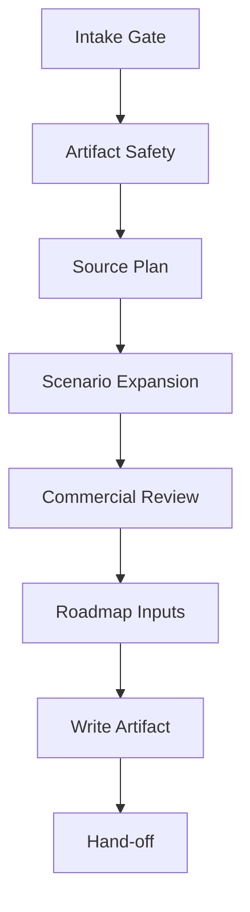

# Commercialize - Commercial Strategy To Roadmap Input

Turn a product idea or existing requirements into a commercial strategy brief
that `/roadmap` can use without inventing business rationale. This skill is an
artifact stage, not a code stage.

Before replacing existing human-edited artifacts or accepting weak commercial
evidence into priority work, read `../../WORKFLOW-CONTRACTS.md` and apply
**Human Approval Routing**.

It can run before or after `/brainstorm`:
- If `requirements.md` exists, treat it as the product contract.
- If `requirements.md` is missing, continue from the user statement, mark the
  result as `pre-requirements`, and hand off to `/brainstorm --slug <slug>`
  before architecture, implementation, or tests.

## Arguments

Raw: `$ARGUMENTS`

Parse:
- `--slug <name>` -> feature/product artifact at `.idea-to-ship/<slug>/commercialization.md`.
- `--portfolio` -> portfolio artifact at `.idea-to-ship/commercialization.md`.
- `--goal <text>` -> commercial objective, e.g. `find first paid path`.
- `--horizon <text>` -> time, release, or effort horizon.
- `--market <text>` -> target market or segment note.
- Remaining text -> product notes, business constraints, evidence, or exclusions.

Default slug: `current`. Default mode: slug mode.

## Operating Stance

Do not flatter the user or preserve every proposed idea as a roadmap candidate.
Treat user ideas as inputs to evaluate, not decisions to justify. The final
brief must contain the skill's own recommendation, including explicit rejections
when an idea is impractical, too expensive for the likely return, weakly
evidenced, or misaligned with the chosen commercial motion.

The synthesis owner makes decisions. Do not hide behind "there are tradeoffs"
when the evidence is enough to choose.

## Workflow

Track progress with a visible checklist and update it after intake, artifact
safety, source planning, scenario expansion, review rounds, roadmap translation,
artifact write, and hand-off.

### Step 1: Intake Gate

1. Read `../../LANGUAGE.md` and `../../WORKFLOW-CONTRACTS.md`. Read
   `../../PRINCIPLES.md` if this run will affect downstream code-producing
   stages.
2. Resolve output:
   - Slug mode -> `.idea-to-ship/<slug>/commercialization.md`
   - Portfolio mode -> `.idea-to-ship/commercialization.md`
3. Read existing `commercialization.md` if present. This run is a refinement
   unless the user explicitly asks to start over.
4. Read `requirements.md` if present. If absent, proceed only as
   `pre-requirements`.
5. Read existing `roadmap.md` if present so commercial conclusions can preserve
   stable item IDs and avoid contradicting committed roadmap decisions.
6. Establish, before writing:
   - Product or offer being commercialized
   - Commercial goal
   - Horizon
   - Primary ICP and buyer/user split
   - Current evidence sources
   - Non-goals or excluded markets

If product, goal, horizon, ICP, or evidence basis is unclear, ask one concise
batch of 3-5 questions. Do not write a final-looking brief with hidden guesses.

### Step 1.5: Artifact Safety

Preserve human edits:
- If generated markers exist, update only the generated block.
- If the file has no generated markers and contains human content, write
  `commercialization.draft.md` or use Human Approval Routing before replacing.
- Preserve manually accepted ICPs, pricing notes, rejected markets, and open
  decisions unless the user explicitly changes them.

Use generated markers:
`<!-- idea-to-ship:commercialize generated:start -->`
`<!-- idea-to-ship:commercialize generated:end -->`

### Step 2: Source Plan

List included and excluded sources before deep analysis.

Default sources:
- User statements in the current request
- `requirements.md`, if present
- Existing `commercialization.md`, if present
- Existing slug or portfolio `roadmap.md`, if present
- Repo README/docs/manifests only when they reveal product surface, packaging,
  supported integrations, or operational constraints

Optional sources, only when the user provides or requests them:
- Customer interview notes
- Usage analytics
- Sales/support feedback
- Competitor pages or public market research
- GitHub/GitLab issues, PRs, or milestones
- Recent git history

Do not present market claims, competitor prices, or regulatory constraints as
facts unless they have cited evidence. Put weak or uncited claims under
`Unverified Signals`.

### Step 3: Commercial Scenario Expansion

If the input is a fuzzy idea, expand it into concrete commercialization
scenarios before analyzing pricing or roadmap impact. Do not jump from a vague
idea to one favored business model.

Generate 2-4 candidate scenarios unless the user explicitly asks for one. Each
scenario is a business-context story, not a feature spec. Use stable IDs:
`CS-001`, `CS-002`, etc.

Each scenario must use `../../templates/commercial-scenario.md`, including the
trigger event, current alternative, monetizable pain, value metric, first paid
boundary, cheapest validation, and Disqualifier fields.

Scenario quality rules:
- Prefer buyer pain over feature imagination.
- Make the trigger event specific. "Users need productivity" is not a trigger.
- Identify a real alternative. If the alternative is "nothing", explain why the
  pain still creates budget.
- Include at least one scenario the team might dislike but the market might buy,
  and at least one scenario that tests whether the original idea is commercially
  too weak.
- Mark invented scenarios as `Weak` or `Unknown` until validated.

### Step 4: Commercial Analysis

Analyze these dimensions. Keep unknowns explicit.

1. **ICP and buying motion**
   - Target customer segment
   - User, buyer, approver, and blocker
   - Buying motion: self-serve, PLG, sales-led, partner-led, services-led, or hybrid
   - Adoption trigger and budget owner

2. **Value and willingness to pay**
   - Pain being monetized
   - Value metric: seat, usage, workflow volume, saved labor, risk reduction,
     compliance need, revenue lift, or infrastructure scale
   - Alternatives and switching costs
   - Urgency: must-have, nice-to-have, or speculative

3. **Packaging and pricing hypotheses**
   - Free vs paid boundary
   - Tiering or entitlement model
   - Metering requirement
   - Expansion path
   - Support/SLA/procurement requirements

4. **Commercial blockers**
   - Missing product capabilities that block a sale, trial, procurement,
     activation, retention, expansion, or supportability
   - Operational costs that could make the model unattractive
   - Compliance/security/integration blockers

5. **Evidence quality**
   - `Strong`: signed deal, paid pilot, direct buyer quote, usage data, sales
     pipeline evidence, or repeated support signal
   - `Medium`: credible customer discovery, current competitor pattern,
     repo/product behavior, or repeated internal operator feedback
   - `Weak`: single anecdote, team intuition, generic market assumption, or
     pattern matching
   - `Unknown`: no evidence yet

### Step 5: Multi-Angle Commercial Review

Use distinct reviewer angles so the output is not a single agreeable narrative.
Use runtime-native reviewer agents when the host supports subagents and the
user/host policy authorizes delegation. If subagents are unavailable or not
authorized, run the same angles as separate main-context passes and record
`degraded-same-context-review` in the artifact.

Required angles:
- **Commercial Strategy Reviewer:** buyer, budget, pricing power, market entry,
  expansion path.
- **Skeptical Customer Reviewer:** willingness to pay, urgency, switching cost,
  adoption friction, "why now".
- **Product Roadmap Reviewer:** activation, retention, packaging boundary,
  roadmap focus, scope control.
- **Delivery Cost Reviewer:** engineering effort, integration burden,
  operational cost, support cost, implementation risk.

Optional angles, only when signaled:
- **Sales / GTM Reviewer:** sales cycle, procurement, enablement, channel fit,
  enterprise readiness.
- **Finance Reviewer:** margin, payback period, unit economics, cost to serve.
- **Risk / Compliance Reviewer:** security, legal, privacy, regulated buyer
  requirements.

Do not ask every angle to do the same job. Each reviewer must return the
reviewer findings table in
`../../templates/commercial-review-and-hypothesis.md`.

#### Review Rounds

Run at least two rounds for non-trivial commercialization work.

1. **Round 0 - Normalize inputs:** list all commercial ideas, scenario
   candidates, assumptions, candidate features, pricing hypotheses, and
   proposed segments. Split compound ideas so each can be judged independently.
2. **Round 1 - Independent review:** each angle evaluates the ideas without
   seeing the other reviewers' conclusions. Require direct objections, not just
   opportunities.
3. **Round 2 - Adversarial pruning:** challenge every `Keep` or `Change`
   recommendation with:
   - What would make this fail commercially?
   - What is the cheapest validation?
   - What is the likely build or operating cost?
   - What measurable revenue lever does this improve?
   - What should we stop doing if this is wrong?
4. **Round 3 - Conflict resolution:** compare reviewer disagreements. The
   synthesis owner chooses a verdict and explains why one angle outweighed the
   others. Do not average conflicting opinions into vague compromise.
5. **Round 4 - Roadmap translation:** only surviving ideas become roadmap
   inputs. Rejected and deferred ideas stay visible with reasons.

#### Verdicts

Use one of these verdicts for every idea:
- `Pursue`: strong or medium evidence, clear revenue lever, acceptable cost.
- `Validate First`: plausible, but needs a cheap experiment before roadmap
  commitment.
- `Split`: valuable core exists, but the proposed scope is too large.
- `Defer`: potentially useful, but not relevant to the current horizon.
- `Reject`: no credible buyer, no clear value metric, too costly, or conflicts
  with the chosen motion.
- `Kill`: actively harmful, distracts from the commercial goal, or increases
  cost without a plausible return.

High-cost low-return ideas must be rejected or split unless the user explicitly
accepts the cost and supplies the strategic reason.

### Step 6: Convert To Roadmap Inputs

Map product work to business impact. Use stable commercial hypothesis IDs:
`CH-001`, `CH-002`, etc.

Each hypothesis must include:

Use the commercial hypothesis table in
`../../templates/commercial-review-and-hypothesis.md`, with `CH-001`,
`CH-002`, etc.

Revenue levers:
- `Activation`
- `Conversion`
- `Retention`
- `Expansion`
- `Sales Enablement`
- `Procurement / Compliance`
- `Cost To Serve`
- `Strategic Option`

Classify every roadmap candidate:
- `Commercial Gate`: required before charging, selling, renewing, or expanding
- `Differentiator`: increases win rate or pricing power but is not a gate
- `Packaging`: enables tiering, entitlement, metering, or paid/free boundary
- `Experience`: improves activation or retention but has indirect revenue link
- `Operational`: reduces delivery/support/compliance cost
- `Speculative`: plausible but weakly evidenced

Rules:
- `Weak`, `Unknown`, and `Speculative` items cannot be recommended as `Now`
  unless the user explicitly approves them through Human Approval Routing when
  available.
- A paid feature candidate needs a buyer, value metric, validation check, and
  stop condition.
- Pricing numbers are hypotheses unless backed by cited evidence.
- Commercialization can prioritize product work, but it cannot replace
  `requirements.md` for design or implementation.

### Step 7: Write `commercialization.md`

Use `../../templates/commercialization.md`. Preserve Human-Owned Sections, use
the commercialize generated markers, include Review Rounds, Commercial
Hypotheses, Feature-To-Business Impact, Rejected / Costly Low-Return Ideas,
Experiments And Metrics, Open Decisions, Unverified Signals, and Handoff To
Roadmap.

### Step 8: Hand-Off

Tell the user:
- Where the artifact was written.
- Whether it is `pre-requirements`, `draft`, or `reviewed`.
- The recommended commercial scenario, plus the strongest rejected scenario.
- The top 3 commercial decisions still needed.
- The strongest rejected or split idea, with the reason.
- The recommended next command:
  - If `requirements.md` is missing: `/brainstorm --slug <slug>` using the
    commercial assumptions as input.
  - If priorities need sequencing: `/roadmap --slug <slug> --goal "<goal>" --horizon "<horizon>"`.
  - If roadmap priorities are already approved: `/roadmap --slug <slug> --goal "<goal>" --horizon "<horizon>" --final`.

## Anti-Patterns

- **Business theater.** Do not turn generic market claims into roadmap priority.
- **User-pleasing summaries.** Do not make every idea sound viable. If the idea
  is weak, expensive, or commercially incoherent, say so and reject it.
- **Feature-first commercialization.** Start from buyer pain and value metric,
  not from a list of features the team wants to build.
- **One-scenario anchoring.** Do not turn a fuzzy idea into the first plausible
  scenario and stop. Generate alternatives, then prune.
- **Fake pricing certainty.** Treat unvalidated prices as hypotheses.
- **Roadmap laundering.** Do not use commercial language to push weak product
  ideas into `Now`.
- **Skipping requirements.** Commercialization can happen before `/brainstorm`,
  but design and implementation still require `requirements.md`.

## Phase Gates

- **Gate before writing:** product, goal, horizon, ICP, and evidence basis must
  be explicit or listed as open decisions.
- **Gate before scenario synthesis:** fuzzy ideas need multiple scenario
  candidates with trigger event, alternative, monetizable pain, validation, and
  disqualifier.
- **Gate before synthesis:** every idea must have a reviewer verdict from at
  least the required angles, or the artifact must record the degraded review
  reason.
- **Gate before recommending Now:** every Now candidate must cite evidence,
  revenue lever, validation check, and stop condition.
- **Gate before roadmap handoff:** rejected, deferred, split, and costly
  low-return ideas must be visible with reasons. Do not quietly drop them.
- **Gate before downstream build:** if `requirements.md` is missing, the next
  build-oriented action is `/brainstorm`, not `/architect` or `/implement`.

## Related Skills

- `$idea-to-ship:brainstorm` writes the product contract required before build stages.
- `$idea-to-ship:roadmap` consumes commercial hypotheses for sequencing.
- `$idea-to-ship:architect` consumes accepted requirements after commercial context is settled.
