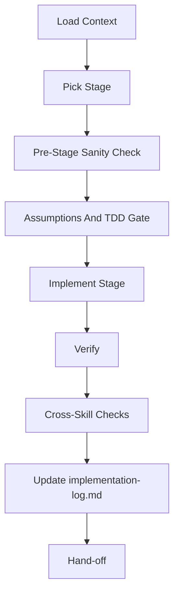

# Implement — Staged Build From Architecture

Read `architecture.md` and build it. One stage at a time by default, so you can
review and course-correct before the next stage. Every stage leaves the system
in a working state. For any stage that writes production code or changes
observable behavior, call `$idea-to-ship:tdd` first to create the failing test
gate; then implement until that gate passes.

This skill writes code. It does **not** commit, push, or run adversarial review — those are separate (`git` is yours; use `/review-code` when a stage is complete).

**Before coding, read `../../PRINCIPLES.md`, `../../LANGUAGE.md`, and
`../../WORKFLOW-CONTRACTS.md` at the plugin root.** PRINCIPLES includes the
local 12-rule execution contract and governs every line written here. LANGUAGE
defines shared terms (vertical slice, staged implementation, design drift,
seam, blast radius) — use them precisely.
WORKFLOW-CONTRACTS defines cross-skill routing.

## Arguments

Raw: `$ARGUMENTS`

Parse:
- Optional leading `--slug <name>`. Default slug: `current`.
- Optional `--tdd` flag is accepted for compatibility but is redundant; TDD is
  already the default for production-code or behavior-changing stages.
- Optional `--compete` or `--tournament` -> before normal implementation, run
  `$agent-playbook:implementation-tournament` for this stage and adopt only the
  selected candidate patch.
- Remaining: stage selector:
  - `<N>` → implement stage N only (e.g. `2`)
  - `all` → run every remaining stage sequentially, pausing between for user confirmation
  - empty → implement the next incomplete stage (default)

## Workflow

### Step 1: Load Context

1. Resolve `.idea-to-ship/<slug>/`.
2. Require `requirements.md`. If missing → stop, tell user to run `/brainstorm --slug <slug>`.
3. Require `architecture.md`. If missing → stop, tell user to run `/architect --slug <slug>`.
4. Read `requirements.md`, `architecture.md`, `interface-design.md` (if
   present), project `DESIGN.md` (if present and the stage touches UI),
   `test-plan.md` (if present), and `../../WORKFLOW-CONTRACTS.md` fully enough
   to apply **Cross-Skill Routing**. Do not treat a missing
   `interface-design.md` as harmless until the selected stage has been checked
   for UI work in Step 3.
5. Read or create `implementation-log.md` using
   `../../templates/implementation-log.md`. Use the template for stage status,
   assumptions, decisions, deviations, verification, TDD evidence, and
   cross-skill check fields. Mirror the stages from `architecture.md`
   § Staged Implementation Plan in its `## Stage Status` list.

### Step 2: Pick The Stage

- If argument is `<N>` → jump to that stage.
- If argument is `all` → start from first unchecked stage.
- Otherwise → first unchecked stage.

If all stages are already complete, tell the user and stop.

### Step 3: Pre-Stage Sanity Check

Before writing any code:

1. Re-read the stage's subsection in `architecture.md`.
2. Determine whether the selected stage touches UI. Treat it as a UI stage if
   it changes a user-visible screen, component, layout, style, visual asset,
   interaction state, accessibility behavior, responsive behavior, route/page,
   form, table, chart, navigation, or frontend state that directly changes what
   a user sees. Do not count frontend-only tests, build config, or internal
   data plumbing as UI work unless they alter the visible interface.
3. If the selected stage touches UI and `.idea-to-ship/<slug>/interface-design.md`
   is missing, **stop before coding** and tell the user to run
   `/ui-design --slug <slug>` first. Implementation must consume the UI design
   contract; it must not create one implicitly.
4. Check the current codebase with Grep/Glob/Read to confirm the assumed pre-stage state (are the files mentioned where the doc claims, with roughly the shape it assumed?).
5. If the codebase has drifted from what the architecture or
   `interface-design.md` assumed, **stop and surface the mismatch** rather than
   guessing. Ask the user whether to update the design artifact first or
   proceed with a documented deviation.

### Step 3.5: Surface Assumptions, Then Push Back If Needed

Before writing a single line (per *Think Before Coding* in `PRINCIPLES.md`):

1. Write down the assumptions this stage is making that aren't already
   spelled out in `architecture.md` or, for UI stages, `interface-design.md`.
   Things like: "will use existing `X` helper", "will place the file at `Y`",
   "will rely on library `Z` version ≥ N", or "will use component variant `A`
   because the design system has no exact `B` state".
2. If any assumption has multiple plausible interpretations, **list them and
   pick one explicitly** in the log instead of picking silently.
3. If the stage itself looks wrong now that you're in the code — e.g. the
   proposed interface doesn't compose with an existing one, or the stage is
   redundant with something already present — **stop and push back**. Do not
   implement a design you can see is broken.
4. If a simpler approach than the architecture's would work and you're
   confident, raise it and wait for confirmation. Do not silently substitute.
5. Define the stage's success criteria in the log as a command, test, or
   observable behavior. If no objective check exists, stop or record the
   missing verification path before coding.
6. If architecture, interface design, tests, or code conventions conflict,
   pick the most local and tested authority, name the rejected alternative,
   and record the reason. Do not blend conflicting patterns.

### Step 3.6: TDD Gate (delegate to `$idea-to-ship:tdd`)

If the stage writes production code or changes observable behavior:

1. Use `$idea-to-ship:tdd --slug <slug> --stage <N>` before writing production
   code. The TDD skill owns test derivation, `test-plan.md` stage slices,
   `tdd-log.md`, and the expected failing command.
2. Require TDD evidence before Step 4:
   - `test-plan.md` contains a `## Stage TDD Slices` entry for this stage.
   - `tdd-log.md` records `Mode: stage-tdd`.
   - The targeted test command failed for the expected reason.
3. If `$idea-to-ship:tdd` blocks because the stage is too broad or the repo
   lacks necessary test tooling, stop and surface that blocker. Do not inline a
   weaker same-context TDD substitute inside `/implement`.

If the stage is docs-only, metadata-only, or otherwise has no meaningful
runtime behavior, do not fake TDD. Document why TDD is not applicable for this
stage and continue with normal implementation.

### Step 3.7: Optional Implementation Tournament

If `--compete`, `--tournament`, or an explicit user request for competing
implementations is present, route to `$agent-playbook:implementation-tournament`
before Step 4.

Pass the tournament skill:
- Caller: `implement`
- Slug and stage number
- `requirements.md`, `architecture.md`, `interface-design.md` if present,
  `DESIGN.md` if relevant, `test-plan.md`, and `tdd-log.md`
- The selected stage subsection and non-goals
- The expected failing-then-passing TDD command, if applicable
- Verification commands and cross-skill checks known so far
- Artifact path: `.idea-to-ship/<slug>/implementation-tournament.md`

The tournament must run candidates in isolated worktrees, verify every
candidate with the same checks, and apply only the selected patch back to the
active worktree. If it returns `No Winner`, stop and update
`implementation-log.md` with the tournament outcome instead of writing a
fallback implementation in the same turn.

### Step 4: Implement The Stage

Build it. Keep in mind:

- **Follow the repo's existing conventions**, not external templates. Match naming, layering, error handling, logging style used nearby.
- **Minimum viable change.** Do not add helpers, abstractions, or future-proofing that the architecture did not call for. A stage is about doing the described thing — nothing more.
- **No speculative error handling.** Validate at system boundaries only. Don't wrap internal calls in defensive try/except that swallows real bugs.
- **No scope creep.** If you spot an adjacent bug or cleanup opportunity, note it in the log; do not fix it in this stage.
- **Keep it working.** At the end of the stage the build, type-checker, and existing tests must pass. Run them. If something fails, fix it before declaring the stage done.
- **Respect interface contracts.** For UI stages, follow `interface-design.md`
  and project `DESIGN.md` for component choices, states, responsive behavior,
  accessibility, and visual QA. If implementation needs to diverge, stop or
  document the deviation in the log before coding around it.
- **TDD-first:** do not write production code before the stage's failing tests
  exist and fail for the expected reason, unless the stage is explicitly
  documented as not TDD-suitable because it has no meaningful runtime behavior.

For each file touched:
- Prefer Edit over rewrite.
- If adding a new file, put it where the architecture said.

### Step 5: Verify

Run whatever the repo uses to verify code is working:

- Build / compile
- Type check / lint (if fast)
- Existing test suite (if fast; otherwise run only tests near the changed files)

Report the results concisely. If anything is broken, fix it before moving on.

For code-producing stages, rerun the targeted command from `tdd-log.md` after
implementation and require it to pass before the stage is done. Do not expand
into full-suite test planning here; broader traceability still belongs to
`/test`.

### Step 5.5: Cross-Skill Checks

Apply `../../WORKFLOW-CONTRACTS.md` § Cross-Skill Routing to the current stage
and diff. Run read-only or artifact-only routed skills when their signal is
present; recommend anything that would mutate code, git, GitHub/GitLab,
deployment state, credentials, or external systems unless the current request
explicitly authorized that action.

Use the implementation-stage route table in
`../../WORKFLOW-CONTRACTS.md` instead of duplicating it here. Record each
triggered route in the `### Cross-Skill Checks` section from
`../../templates/implementation-log.md`, including trigger, result, and impact.

### Step 6: Update The Log

Append a stage section to `implementation-log.md` using
`../../templates/implementation-log.md`. Keep the template's named fields for
pre-stage assumptions, success criteria, decisions, deviations, verification,
TDD evidence, and cross-skill checks instead of inventing an inline log shape.
Tick the stage's checkbox in the `## Stage Status` list at the top.

### Step 7: Hand-off

1. Print a concise summary: stage name, files touched count, deviations (if any), verification status.
2. Next-step suggestion:
   - If more stages remain and mode is `all` → ask "Continue to stage N+1?" and loop on confirmation.
   - Otherwise suggest: "Run `/test` for traceability if needed, then `/review-code` for adversarial review."
3. Do **not** commit.

## Related Skills

- `$idea-to-ship:tdd` creates the stage-local failing test gate for production
  code or behavior-changing stages.
- `$idea-to-ship:ui-design` writes the required UI contract before UI stages.
- `$idea-to-ship:test` owns broad story, scenario, and verification
  traceability.
- `$idea-to-ship:review-code` performs adversarial review after implementation.
- `$agent-playbook:implementation-tournament` is available only when explicitly
  requested by `--compete`, `--tournament`, or the user.

## Anti-Patterns

- **Big-bang implementation.** Implementing all stages at once, or treating "all" mode as permission to skip the pause between stages. Each stage must leave the system working. If you find yourself thinking "I'll fix the breakage in stage 3" while in stage 2, you're doing it wrong — stage 2 must work on its own.
- **Silent deviation.** The architecture or interface design says X, you do Y
  because it's "obviously better." This is design drift (see
  `../../LANGUAGE.md`). Either push back and update the design artifact first,
  or document the deviation in the log. Never just do it.
- **Visual freelancing.** A UI contract exists, but the implementation invents
  colors, spacing, components, or states because they "look better." Update the
  contract or document the deviation; do not silently fork the design system.
- **Implicit UI design.** A stage touches UI but no `interface-design.md`
  exists, so the implementer designs from screenshots, vague notes, or taste
  during implementation. Stop and run `/ui-design --slug <slug>` first.
- **Tournament by default.** Multiple implementations are expensive. Use
  `$agent-playbook:implementation-tournament` only when explicitly requested by
  `--compete`, `--tournament`, or the user.
- **Speculative scaffolding.** Adding config knobs, feature flags, abstraction layers, or "flexibility" that no stage calls for. This stage is about doing the described thing — nothing more.
- **Horizontal slicing.** Writing all the models first, then all the handlers, then all the tests. Each stage should be a vertical slice — end-to-end through all layers, delivering one observable behavior. If you're implementing "the database layer" as a stage, the architecture is sliced wrong — push back.
- **Fake TDD.** Writing tests after implementation and calling it TDD, or
  writing tests that pass before the behavior exists. For code-producing
  stages, `$idea-to-ship:tdd` and its expected failing test are the gate.

## Phase Gates

- **⛔ GATE after Step 3 (Sanity Check):** If the codebase has drifted from what
  `architecture.md` or `interface-design.md` assumed, STOP. Do not improvise
  around the mismatch. Surface it, get a decision (update the design artifact
  or proceed with documented deviation), then continue.
- **⛔ GATE after Step 3 (UI Contract):** If the selected stage touches UI and
  `.idea-to-ship/<slug>/interface-design.md` is missing, STOP and run
  `/ui-design --slug <slug>` first. Do not infer UI layout, components,
  responsive behavior, or visual treatment inside `/implement`.
- **⛔ GATE after Step 3.5 (Surface Assumptions):** Assumptions must be written down before any code is written. If an assumption has multiple plausible interpretations, you must pick one explicitly and log the pick. "I'll figure it out as I go" is not an option.
- **⛔ GATE after Step 3.6 (TDD):** Production-code and behavior-changing
  stages must have `$idea-to-ship:tdd` evidence before production code is
  written. If TDD is skipped, the log must explain why the stage has no
  meaningful runtime behavior.
- **⛔ GATE after Step 3.7 (Tournament):** If tournament mode is enabled,
  `$agent-playbook:implementation-tournament` must return an adopted patch,
  merged patch, or `No Winner`. Do not continue with an unreviewed same-context
  fallback after `No Winner`.
- **⛔ GATE after Step 5 (Verify):** Build, lint, and existing tests must pass. If anything fails, fix it before declaring the stage done. Do not move to Step 6 with a broken build — a "mostly done" stage is worse than an unstarted one.
- **⛔ GATE after Step 5.5 (Cross-Skill Checks):** Triggered cross-skill checks
  must run, be explicitly skipped with a reason, or be recommended as
  user-authorized follow-up. Do not mark a stage complete while a triggered
  secret scan or safety check is silently omitted.

## Notes

- Never skip Step 3 (sanity check). Drift between doc and reality is the #1 cause of bad stage-1 implementations.
- If a stage turns out to be too big mid-implementation, stop, split it in the architecture doc, update Stage Status, and finish only the first half. Honesty about scope beats a half-working stage.
- If the architecture says something demonstrably wrong once you're in the code (e.g. proposed interface doesn't compose with an existing one), stop and fix the architecture doc first. Implementations should not silently diverge from design.
