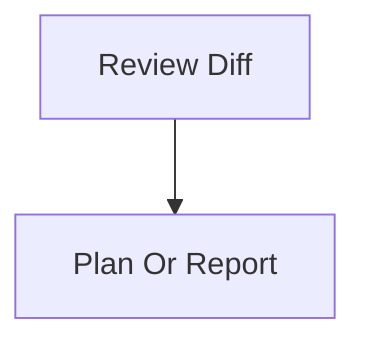

# Review Code — Adversarial Review Loop For Implementation

Run a risk-scaled review of the current code changes (staged + unstaged).
Select `review_intensity` automatically, unless the user forces
`--review-depth quick|standard|deep`. `deep` is the blunt adversarial mode with
multiple independent reviewer agents and multiple angles. Findings that
require code, test, architecture, or design artifact edits become a
Plannotator modification plan; this skill does not directly edit files after
review.
Anchored to the requirements, architecture, interface design, implementation
log, and test plan so drift and missing verification are caught.
Same-context review is a fallback only when reviewer sub-agents are explicitly
unsupported by the host/runtime, explicitly forbidden by the user, or the
selected reviewer/model is explicitly unavailable or at capacity; record the
degradation reason.

## Arguments

Raw: `$ARGUMENTS`

Parse:
- Optional `--slug <name>`. Default slug: `current`.
- Optional `--review-depth quick|standard|deep`. If present, force that
  intensity and record it in `code-review.md`.
- Remaining text → extra focus areas (e.g. "concurrency", "error handling", "SQL injection").

## Multi-Agent Review Routing

Read `../../PRINCIPLES.md` and `../../WORKFLOW-CONTRACTS.md`. Apply the shared
**Review Intensity Selection** and **Multi-Agent Review Routing** contracts.
Launch independent reviewer agents for selected `standard` and `deep`; for
selected `quick`, run the same-context checklist from the shared contract and
do not label it degraded.

- **Correctness/security angle:** bugs, edge cases, data loss, concurrency,
  auth, injection, serialization, shell, and other risky boundaries.
- **Traceability/testability angle:** requirement/story/acceptance/scenario/test
  trail, TDD evidence, regression coverage, and stage completeness.
- **Maintainability/repo-fit angle:** local conventions, abstraction cost,
  dead code, design drift, and surgical scope.
- **UI/UX angle:** required when `interface-design.md` exists or the diff
  touches UI; checks component, visual token, interaction-state, responsive,
  accessibility, and visual QA expectations.

If reviewer sub-agents are explicitly unsupported by the host/runtime, the user
explicitly forbids reviewer sub-agents, or the selected reviewer/model is
explicitly unavailable or at capacity, write `code-review.md` with `Result:
degraded-same-context-review`, record the exact reason, and run the same
adversarial review prompts in the main context.

## Plannotator Modification Plan Gate

Apply `../../WORKFLOW-CONTRACTS.md` Review Loop Shape and Human Approval
Routing. When kept findings require code, test, architecture, or design
artifact edits, write `.idea-to-ship/<slug>/code-review-modification-plan.md`
before any edits. Include finding id/severity/path/source angle, planned edits
by file, verification/re-review, user-owned decisions, and skipped findings.
If current-conversation approval bypass is active, record
`bypassed-current-conversation` as the approval source; bypass skips approval,
not planning. If Plannotator is unavailable and no bypass is active, record
that in `code-review.md` and stop without editing.

## Workflow

Track the review loop with a checklist. Update the status after input
verification, each reviewer iteration, modification-plan generation, final
holistic review, and `code-review.md` handoff.



### Step 1: Verify Inputs

1. Resolve `.idea-to-ship/<slug>/`. Require `requirements.md`. If missing,
   stop and tell the user to run `/brainstorm --slug <slug>` first. Read
   `requirements.md`, plus `architecture.md`, `interface-design.md`,
   `implementation-log.md`, `test-plan.md`, `visual-test-report.md`,
   `visual-test-matrix.md`, `visual-artifact-rca.md`, and
   `visual-test-selectors.md` if present.
2. Check that there's a diff to review:
   ```bash
   git diff --shortstat
   git diff --shortstat --cached
   git status --short
   ```
   If empty, tell the user there's nothing to review and stop.
3. If `test-plan.md` is absent, remember that fact for the review context.
4. If `visual-test-report.md` or `visual-test-matrix.md` is present, load all
   visual-test artifacts that exist. If the diff is a UI-touching diff, require
   both `visual-test-report.md` and `visual-test-matrix.md`; set
   `VISUAL_TEST_REPORT_MISSING` or `VISUAL_TEST_MATRIX_MISSING` for whichever
   artifact is absent.
5. Build a bounded review context before contacting reviewers. Include exact
   artifact paths and section anchors, then summarize long artifacts instead of
   pasting them wholesale:
   - Requirements, architecture, implementation log, and test plan: include
     relevant sections first; cap each artifact at 200 lines or 16 KiB.
   - Visual-test artifacts: include report summary, matrix status counts,
     failed/flaky/missing/stale cells, baseline decisions, fingerprint fields,
     and RCA summaries; cap combined visual evidence at 24 KiB.
   - If any artifact is truncated, set `context_truncated: true` and list
     omitted paths/sections so reviewers can ask for a focused follow-up.

### Step 2: Collect The Diff

```bash
git status --porcelain=v1 -z --untracked-files=no
git diff --binary --full-index --no-ext-diff --no-color
git diff --cached --binary --full-index --no-ext-diff --no-color
git ls-files --others --exclude-standard -z
```

Capture unstaged and staged diffs separately. This is the review target.

For binary tracked changes, include path and SHA-256 summaries in the review
payload instead of raw binary patches. Use full binary diffs only as hash input
for `workspace_diff_fingerprint`, not as reviewer context.

When visual-test artifacts exist or the diff touches UI, compute the current
`workspace_diff_fingerprint` with the same contract as `$idea-to-ship:visual-test`:
tracked porcelain status, full binary staged and unstaged diffs, and a sorted
`untracked_files_manifest` from `git ls-files --others --exclude-standard -z`,
excluding the current slug's visual evidence artifacts
(`visual-test-selectors.md`, `visual-test-matrix.md`, `visual-artifact-rca.md`,
and `visual-test-report.md`) from the fingerprint hash input.
Every untracked file must be classified as a content-hashed relevant input or
excluded with rationale. If the fingerprint cannot be computed, treat that as a
visual evidence gap rather than "fresh." If it differs from
`visual-test-report.md`, flag stale fingerprint evidence.

Include bounded untracked file evidence in the review payload when those files
are relevant to the diff or fingerprint: text file contents with path and
truncation note, and binary files as path plus SHA-256 only. Sensitive
auth/session/cookie/token/log/env-like untracked files must never be included as
raw text; represent them as path + SHA-256 + redacted summary only. Run
secret-scan or equivalent redaction before including any untracked text content.
Do not let an untracked file affect freshness without giving reviewers either
safe text content, a redacted sensitive summary, or its binary hash.

Keep untracked text bounded: cap each text file excerpt at 200 lines or 8 KiB
and cap total untracked text at 32 KiB. Include path, SHA-256, classification,
and `truncated: true|false` for every relevant untracked entry. If the text diff
is too large for one reviewer prompt, split review assignments by path group and
include a complete changed-path manifest plus omitted-hunk notes.

If `test-plan.md` is absent and the diff changes observable behavior, set
`TEST_PLAN_MISSING=true`. This is review context, not an automatic failure: the
reviewer must flag it as a verification gap unless the implementation log or
current request documents why no test plan is applicable.

If the diff touches UI, set `UI_DIFF=true`. If `UI_DIFF=true` and
`visual-test-report.md` is absent, set `VISUAL_TEST_REPORT_MISSING=true`. If
`UI_DIFF=true` and `visual-test-matrix.md` is absent, set
`VISUAL_TEST_MATRIX_MISSING=true`. Either flag is missing visual evidence and
reviewers must report it. If visual-test artifacts exist, compare the current
`workspace_diff_fingerprint` to the report; stale fingerprint evidence must be
flagged. Reviewers must also flag missing matrix evidence, unresolved visual
failures, missing baseline approval, weak artifact anchors, and unjustified
console/network failures.

### Step 3: Select Review Intensity

Apply `../../WORKFLOW-CONTRACTS.md` Review Intensity Selection using the current
diff, artifacts, and user arguments:

- Auto-select `quick`, `standard`, or `deep` by risk.
- Honor `--review-depth quick|standard|deep` as a forced override.
- Record `Review intensity: <tier> (<auto|forced>: <reason>)` in
  `code-review.md`.
- Escalate if a lower tier discovers security, data-loss, external-IO,
  persistence, public-contract, UI visual-evidence, or broad-scope risk.

### Step 4: Review Loop

Track iteration count starting at 1. `deep` maxes at 5 iterations; `quick` and
`standard` use the caps in `../../WORKFLOW-CONTRACTS.md`.

#### 4a — Multi-Agent Review

For `quick`, run one same-context checklist over correctness/security,
traceability/testability, and maintainability/repo-fit. If it finds issues that
require edits, generate a Plannotator modification plan instead of editing.

For `standard`, launch the required reviewer agents in parallel when possible
for one multi-angle round. If findings require edits, generate a Plannotator
modification plan. After a user-approved plan is applied in a separate pass,
re-review only affected angles unless the change affects architecture, public
contracts, security, data flow, UI evidence, or broad scope.

For `deep`, launch the required reviewer agents in parallel when possible. Each reviewer
gets the shared prompt plus its assigned angle. If fewer than the required
reviewer agents can run because reviewer sub-agents are explicitly unsupported
by the host/runtime, explicitly forbidden by the user, or the selected
reviewer/model is explicitly unavailable or at capacity, continue as
`degraded-same-context-review` using the same prompts in the main context and
record the reason.

```
Adversarial code review (iteration <N>, angle: <angle>). Be blunt, skeptical,
no hedging. Find real bugs, security holes, bad abstractions, and wrong code
within your assigned angle.

SCOPE RULES (important):
- Only report issues within the lines changed in this diff.
- Do NOT flag lint/style/format issues in unchanged surrounding code.
- Within the diff, only flag style if the change introduces NEW inconsistency
  with what's already in this repo. Do not flag pre-existing patterns the diff
  happens to touch.
- Check the diff against the architecture. If the implementation deviates from
  the design in a way the implementation-log does not justify, flag it as a
  "design drift" issue.
- If `interface-design.md` is provided and the diff touches UI, check component
  choices, visual tokens, interaction states, responsive behavior,
  accessibility, and visual QA expectations against it. Undocumented
  divergence is design drift.
- If the diff touches UI and either `VISUAL_TEST_REPORT_MISSING` or
  `VISUAL_TEST_MATRIX_MISSING` is true, flag missing visual evidence. If visual
  artifacts are provided, check `aggregate_verdict`, `blocking_reasons`,
  `visual-test-matrix.md`, `visual-artifact-rca.md`, and
  `visual-test-selectors.md`. Flag stale fingerprint evidence, missing matrix
  evidence, unresolved `FAIL`, `FLAKY`, `MISS`, or `NEEDS-RUN` cells,
  non-de-scoped `SKIP-with-reason`, missing baseline approval, weak artifact
  anchors, unclassified untracked files, and unjustified console/network
  failures.
- Check the diff against the test plan. If a behavior-changing implementation
  lacks traceability from requirement -> story -> acceptance criterion ->
  scenario -> test, flag it as a verification gap. For fixes or user-visible
  behavior, missing tests are a warning; for bug fixes with no reproducible
  regression test, upgrade to critical unless there is a documented reason.
- If `test-plan.md` is not provided and the diff changes observable behavior,
  flag a warning-level verification gap. For bug fixes without a reproducible
  regression test, upgrade to critical unless there is a documented reason.

## Requirements (required context)
<requirements.md>

## Architecture (context, may be empty)
<architecture.md or "not provided">

## Interface Design (context, may be empty)
<interface-design.md or "not provided">

## Implementation Log (context, may be empty)
<implementation-log.md or "not provided">

## Test Plan (context, may be empty)
<test-plan.md or "not provided">

## Visual Test Evidence (context, may be empty)
Report: <path plus bounded summary/anchors, or "not provided">
Matrix: <path plus status counts and affected cell summaries, or "not provided">
Artifact RCA: <path plus bounded summaries/anchors, or "not provided">
Selectors: <path plus selector/state summary, or "not provided">
UI-touching diff: <true|false>
Missing visual evidence: <true|false>
Current workspace_diff_fingerprint: <fingerprint or VISUAL_EVIDENCE_GAP when not computed>
context_truncated: <true|false; include omitted paths/sections when true>

## Extra Focus From User
<extra focus text, or "none">

## Diff To Review
<full text diff when within budget, otherwise complete changed-path manifest plus focused hunks>
<bounded relevant untracked file contents with SHA-256/classification/truncation, or binary path + SHA-256>

For each issue, report severity, file:line, concrete problem/impact, and
concrete fix.

If no material issues exist for your assigned angle, reply with exactly: LGTM
```

#### 4b — Evaluate & Plan

- **LGTM from every required reviewer angle** → break, proceed to Step 5.
- Otherwise:
  1. One-line summary: `Iteration N: <angle> X critical, Y warnings, Z nits (W skipped out-of-scope).`
  2. Filter before planning:
     - Drop issues that are pure style/format in code the diff did not actually change.
     - Drop nits unless they are part of the same necessary change.
     - Keep criticals, warnings, and any design-drift issues.
  3. Generate `.idea-to-ship/<slug>/code-review-modification-plan.md` using
     the Plannotator Modification Plan Gate. Do not touch unrelated code and
     do not edit the reviewed files here.
  4. If a fix requires a user decision (tradeoff, spec ambiguity), put the
     decision and options in the plan. Do not guess.
  5. Stop after the Plannotator plan is generated and its approval status is
     recorded. A later approved modification pass applies the plan.

#### 4c — Approval Boundary

If the plan is approved in the same conversation, including by
`bypassed-current-conversation`, treat implementation of that plan as a
separate modification pass, not a continuation of review. Apply only the
approved plan, then run the appropriate review again. For `deep`, re-run every required reviewer angle after the approved changes land.

### Step 5: Final Holistic Pass

After LGTM or after the Plannotator modification plan is generated, run the
holistic pass required by the selected intensity:

1. Re-read `git diff HEAD`, `git diff --cached`, and the plan when present.
2. Check requirements, architecture, public interfaces, security boundaries,
   dead code, test traceability, and `../../PRINCIPLES.md`.
3. If new problems appear, add them to the Plannotator modification plan.

### Step 6: Write `code-review.md`

```markdown
# Code Review — <slug>

**Date:** <YYYY-MM-DD>
**Reviewer:** multi-agent: <angle -> reviewer route>
**Iterations:** <N>
**Result:** <clean | accepted-with-open-issues>
**Review intensity:** <quick|standard|deep> (<auto|forced>: <reason>)
**Mode:** <selected-quick-same-context | multi-agent | degraded-same-context-review>
**Degradation reason:** <none | explicit unsupported runtime | user forbade reviewer sub-agents | reviewer/model unavailable or at capacity>
**Diff size:** <files changed>, <+added/-removed>
**Plannotator modification plan:** <path | not needed | unavailable>
**Plan approval:** <approved | denied | pending | bypassed-current-conversation | not needed | unavailable>

## Issues Raised & Resolution
| # | Severity | File:line | Issue | Planned action / status |
|---|---|---|---|---|
| 1 | critical | src/x.go:42 | ... | planned in code-review-modification-plan.md §... |

## Out-of-Scope Issues Skipped
<Pre-existing style nits etc., for visibility — not planned.>

## Design Drift
<Any place the implementation departed from architecture.md or
interface-design.md, and whether it is planned for implementation fix,
artifact update, accepted documented deviation, or clean.>

## Test Traceability
<Requirement/story/acceptance/scenario/test gaps. Include missing happy path,
edge/corner case, invalid-input, or failure-mode coverage. Empty if clean.>

## Residual Open Issues
<Empty if clean.>

## Final Verdict
| Angle | Verdict |
|---|---|
| correctness/security | LGTM / ... |
| traceability/testability | LGTM / ... |
| maintainability/repo-fit | LGTM / ... |
| UI/UX | LGTM / not applicable / ... |
```

### Step 7: Hand-off

1. Tell the user where `code-review.md` landed and where the plan landed, if
   any.
2. Suggest next step: approve/apply a pending plan; if approval was
   `bypassed-current-conversation`, apply only the recorded plan and re-run
   review; if tests are incomplete, run `/test`; otherwise commit/open PR.
3. Do not commit or push.

## Related Skills

- `$idea-to-ship:visual-test` produces frontend visual evidence consumed during
  UI review.
- `$idea-to-ship:test` produces story, scenario, and verification traceability.
- `$idea-to-ship:implement` writes implementation logs and records design
  deviations before review.

## Anti-Patterns

- **Style nitpicking on logic PRs.** If the diff fixes a race condition, don't produce 15 nits about naming. Focus severity appropriately — a few nits alongside criticals is fine, but nits should never dominate a review that has real issues.
- **Phantom bugs.** "This *could* be null" without checking if callers actually pass null. If you can't show a concrete call path that triggers the failure, it's speculation, not a finding. State the call path or drop the finding.
- **Reviewing the architecture.** If the chosen design is wrong, that's a design review problem. Code review assumes the design is accepted and checks whether the implementation is correct, safe, and clean. Flag design drift, but don't re-litigate architectural decisions.
- **Generic advice.** "Add error handling" without saying what error, from where, and what the handler should do. Every finding must be actionable and specific enough to implement in one edit.
- **Trusting implementation without traceability.** If a behavior changed and
  there is no story/acceptance/scenario/test trail, the implementation is not
  verifiably done. Flag the missing link instead of saying "looks fine".

## Notes

- Scope rules matter. Reviewing surrounding unchanged code always produces noise and no value.
- **Design drift is a first-class finding** (see `../../LANGUAGE.md`). If the implementation took a shortcut the architecture didn't sanction, plan one of: (a) fix the code, (b) update `architecture.md` with a documented reason, or (c) record an accepted deviation in `code-review.md`. Silent drift is forbidden.
- Fall back to same-context review only when reviewer sub-agents are explicitly
  unsupported by the host/runtime, explicitly forbidden by the user, or the
  selected reviewer/model is explicitly unavailable or at capacity. Record
  `degraded-same-context-review` and do not present that result as independent
  multi-agent review.
- Use the Plannotator Modification Plan Gate for user-owned tradeoffs,
  residual-risk acceptance, escalation/abort choices, and approval for
  documented design deviations. Current-conversation bypass skips approval only;
  it never skips writing the plan.
