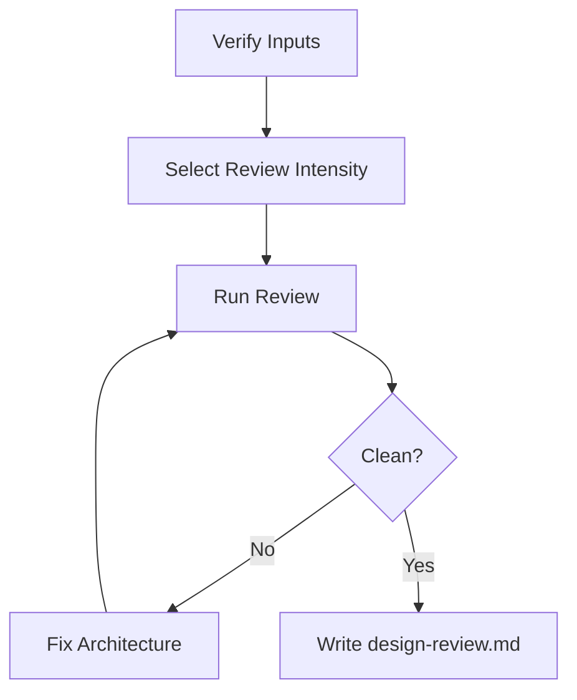

# Review Design — Adversarial Architecture Review

Run a risk-scaled review of `architecture.md`. Select `review_intensity`
automatically, unless the user forces `--review-depth quick|standard|deep`.
`deep` is the blunt adversarial mode with multiple independent review agents
and multiple angles. Every deep round covers every required angle. After deep
fixes, re-run all angles, not just the angle that found a problem. Fix→review
loops until every required reviewer angle returns LGTM or the iteration budget
is exhausted. Same-context review is a fallback only when
reviewer sub-agents are explicitly unsupported by the host/runtime, explicitly
forbidden by the user, or the selected reviewer/model is explicitly unavailable
or at capacity; record the degradation reason.

This is the designed-in correction step. A load-bearing architecture that has
not been torn apart by a skeptical deep reviewer is not ready to implement.

## Arguments

Raw: `$ARGUMENTS`

Parse:
- Optional `--slug <name>`. Default slug: `current`.
- Optional `--review-depth quick|standard|deep`. If present, force that
  intensity and record it in `design-review.md`.
- Remaining text → additional focus areas to emphasize (e.g. "concurrency", "cost", "failure modes").

## Multi-Agent Review Routing

Read `../../PRINCIPLES.md` and `../../WORKFLOW-CONTRACTS.md`. Apply the shared
**Review Intensity Selection** and **Multi-Agent Review Routing** contracts.
Launch independent reviewer agents for selected `standard` and `deep`; for
selected `quick`, run the same-context checklist from the shared contract and
do not label it degraded.

- **Architecture correctness angle:** assumptions, failure modes, interfaces,
  rollout, reversibility, and option tradeoffs.
- **Implementation/testability angle:** stage slicing, repo fit, verification,
  migration risk, and blast radius.
- **UI/UX angle:** required when `interface-design.md` exists; checks flow,
  component, responsive, accessibility, and visual QA preservation.

If reviewer sub-agents are explicitly unsupported by the host/runtime, the user
explicitly forbids reviewer sub-agents, or the selected reviewer/model is
explicitly unavailable or at capacity, write `design-review.md` with `Result:
degraded-same-context-review`, record the exact reason, and run the same
per-angle adversarial review prompts in the main context. Degraded mode still
preserves multi-angle and multi-round structure; it only loses independent
agents.

## Workflow



### Step 1: Verify Inputs

1. Resolve artifact dir `.idea-to-ship/<slug>/`.
2. Require `requirements.md` to exist. If missing, stop and tell the user to run `/brainstorm --slug <slug>` first.
3. Require `architecture.md` to exist. If missing, stop and tell the user to run `/architect --slug <slug>` first.
4. Read `architecture.md`, `requirements.md`, and `interface-design.md` if
   present. If the architecture's recommended option contradicts requirements
   or a UI-facing architecture contradicts `interface-design.md`, flag it as
   design drift before even calling the adversarial reviewer.

### Step 2: Select Review Intensity

Apply `../../WORKFLOW-CONTRACTS.md` Review Intensity Selection using
`architecture.md`, `requirements.md`, optional `interface-design.md`, and user
arguments:

- Auto-select `quick`, `standard`, or `deep` by risk.
- Honor `--review-depth quick|standard|deep` as a forced override.
- Record `Review intensity: <tier> (<auto|forced>: <reason>)` in
  `design-review.md`.
- Escalate if a lower tier discovers security, data-loss, external-IO,
  persistence, public-contract, UI visual-evidence, or broad-scope risk.

### Step 3: Review Loop

Track iteration count starting at 1. `deep` maxes at 5 iterations; `quick` and
`standard` use the caps in `../../WORKFLOW-CONTRACTS.md`.

#### 3a — Multi-Agent Review Round

For `quick`, run one same-context checklist over architecture correctness and
implementation/testability. If fixes are made, run one targeted same-context
confirmation over changed sections.

For `standard`, launch the required reviewer agents in parallel when possible
for one multi-angle round. If fixes are made, re-review only affected angles
unless the fix changes option choice, public contract, security, data flow, UI
evidence, or broad scope; cap at two rounds before asking whether to escalate
to `deep`.

For `deep`, launch the required reviewer agents in parallel when possible. Each reviewer
gets the shared prompt plus its assigned angle. If fewer than the required
reviewer agents can run because reviewer sub-agents are explicitly unsupported
by the host/runtime, explicitly forbidden by the user, or the selected
reviewer/model is explicitly unavailable or at capacity, continue as
`degraded-same-context-review` using the same prompts in the main context and
record the reason.

Each round must produce one verdict per required angle:

| Angle | Required when | Execution |
|---|---|---|
| Architecture correctness | always | independent reviewer agent or degraded same-context pass |
| Implementation/testability | always | independent reviewer agent or degraded same-context pass |
| UI/UX | `interface-design.md` exists | independent reviewer agent or degraded same-context pass |

Do not collapse angles into one generic review. If degraded, run the same
angle prompts sequentially in the main context and label the route degraded.

```
Adversarial architecture review (iteration <N>, angle: <angle>). Be blunt.
Your job is to find weaknesses — not to validate.

REVIEW PRINCIPLES:
- Attack assumptions that aren't justified by evidence in the document.
- Call out missing failure modes, hand-waved scaling claims, and interfaces
  that will hurt callers.
- If the recommended option is weaker than a rejected alternative for the
  stated requirements, say so.
- If `interface-design.md` is provided, check whether UI-facing architecture
  decisions preserve the interface contract: flows, component expectations,
  responsive behavior, accessibility, and visual QA gates.
- Do not invent work. If a concern is out of scope per the requirements,
  say so and move on.
- Do not pile on stylistic nits. Design-level issues only.

## Requirements (for context)
<full content of requirements.md>

## Architecture Under Review
<full content of architecture.md>

## Interface Design (if present)
<full content of interface-design.md, or "not provided">

## Extra Focus From User
<extra focus text, or "none">

For each issue, report:
- Severity: critical / warning / nit
- Location (section or heading in architecture.md)
- The problem, stated concretely
- What specifically needs to change

If you find no material issues for your assigned angle, respond with exactly: LGTM
```

#### 3b — Evaluate & Fix

- If all required reviewer angles return **LGTM** → break, proceed to Step 4.
- Otherwise:
  1. Print a 1-line summary: `Iteration N: <angle> X critical, Y warnings, Z nits.`
  2. For each **critical** and **warning** issue: update `architecture.md` directly with Edit. Be concrete — change the recommendation, rewrite a section, add a failure mode, revise an interface. Do not just append a footnote.
  3. Skip **nits** unless trivially fixable while you're in the file.
  4. If a critical issue requires the user to decide (e.g. a tradeoff they haven't weighed in on), pause the loop and ask. Do not guess on user-owned decisions.
  5. Loop according to the selected intensity. For `deep`, go back to 3a and
     re-run every required reviewer angle, not just the angle that found the
     issue. For `standard`, re-run affected angles unless the fix escalates
     risk. For `quick`, run one targeted confirmation.

#### 3c — Safety Limit

At the selected intensity's cap without LGTM, stop. For `quick` or `standard`,
ask whether to escalate to `deep`, accept residual risk, or abort. For `deep`,
ask whether to continue or accept.

### Step 4: Final Holistic Pass

After LGTM (or user-accepted exit), run the holistic pass required by the
selected intensity. `deep` always gets one last pass looking at the document as
a whole rather than issue-by-issue. `standard` gets it when fixes changed the
recommended option, public contract, or stage structure. `quick` records
residual risk instead of adding a separate holistic pass:

1. Re-read the updated `architecture.md`.
2. Ask yourself:
   - Does the chosen option still make sense after all the revisions? (Sometimes fixes shift the balance — a rejected alternative may now be better.)
   - If `interface-design.md` exists, does the architecture still preserve the
     UI/UX contract or explicitly explain any accepted design drift?
   - Are the staged implementation steps actually independently shippable?
   - Is there anything a new engineer reading this could not act on?
3. If problems remain, do one more targeted edit. Otherwise proceed.

### Step 5: Write `design-review.md`

```markdown
# Design Review — <short title>

**Slug:** <slug>
**Date:** <YYYY-MM-DD>
**Reviewer:** multi-agent: <angle -> reviewer route>
**Iterations:** <N>
**Result:** <clean | accepted-with-open-issues>
**Review intensity:** <quick|standard|deep> (<auto|forced>: <reason>)
**Mode:** <selected-quick-same-context | multi-agent | degraded-same-context-review>
**Degradation reason:** <none | explicit unsupported runtime | user forbade reviewer sub-agents | reviewer/model unavailable or at capacity>

## Issues Raised & Resolution
| # | Severity | Issue | Resolution |
|---|---|---|---|
| 1 | critical | ... | fixed in architecture.md §... |
| 2 | warning  | ... | user decision: <answer> |

## Review Rounds
| Round | Angle | Route | Verdict |
|---|---|---|---|
| 1 | architecture correctness | sub-agent / degraded | ... |
| 1 | implementation testability | sub-agent / degraded | ... |
| 1 | UI/UX | sub-agent / degraded / not applicable | ... |

## Residual Open Issues
<Anything accepted as open. Empty is fine.>

## Design Drift
<Any mismatch between architecture.md and interface-design.md, and whether it was fixed or accepted. Empty if clean.>

## Reviewer Final Verdicts
| Angle | Verdict |
|---|---|
| architecture correctness | LGTM / ... |
| implementation testability | LGTM / ... |
| UI/UX | LGTM / not applicable / ... |

## Self-Review Notes
<What you noticed in the holistic pass. Empty is fine.>
```

### Step 6: Hand-off

1. Tell the user: the architecture file has been updated in place, review log is in `design-review.md`.
2. Print a 3-bullet summary of the biggest changes made during the loop.
3. Suggest: "Run `/implement` to start building."

## Anti-Patterns

- **Piling on.** Finding 30 issues and reporting all of them. Prioritize ruthlessly — criticals first, then warnings. If there are more than 3 criticals, the architecture needs a rewrite, not 30 patches.
- **Inventing work.** Flagging concerns that are explicitly out of scope per `requirements.md`. If requirements say "no real-time sync needed," don't flag "no real-time sync strategy" as a missing failure mode.
- **Cosmetic rewrites.** Rewriting sections for style or prose quality. This is a technical review, not copyediting. Only change text to fix a technical error or add a missing failure mode.
- **Death by a thousand nits.** If the architecture is fundamentally sound, 20 nits don't make it better — they make the reviewer feel productive while adding no value. A clean architecture with 3 real improvements beats one buried under formatting fixes.

## Notes

- This skill writes to `architecture.md` (updates) and `design-review.md` (new). It does not touch source code.
- Fall back to same-context review only when reviewer sub-agents are explicitly
  unsupported by the host/runtime, explicitly forbidden by the user, or the
  selected reviewer/model is explicitly unavailable or at capacity. Record
  `degraded-same-context-review` and do not present that result as independent
  multi-agent review.
- **User-owned decisions always pause the loop.** Do not pick a tradeoff the user should pick.
- **Read `../../LANGUAGE.md`** for shared vocabulary — use "design drift", "blast radius", "falsifiable hypothesis" precisely as defined.

## Related Skills

- `$idea-to-ship:architect` writes the architecture reviewed here.
- `$idea-to-ship:review-code` reviews the implementation after `/implement`.
