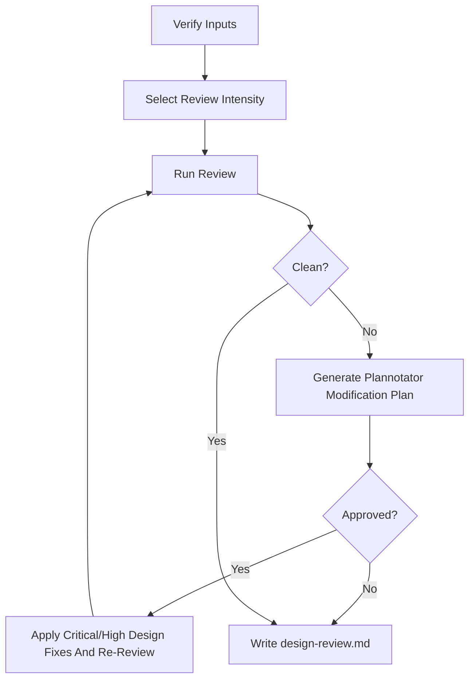

# Review Design — Adversarial Architecture Review

Run a risk-scaled review of `architecture.md`. Select `review_intensity`
automatically, unless the user forces `--review-depth quick|standard|deep`.
`deep` is the blunt adversarial mode with multiple independent review agents
and multiple angles. Every deep round covers every required angle. Findings
that require architecture changes become a Plannotator modification plan before
edits. After Plannotator approval or `bypassed-current-conversation`, apply
only approved critical/high architecture-defect fixes and re-review until no
critical/high design defects remain. Same-context
review is a fallback only when
reviewer sub-agents are explicitly unsupported by the host/runtime, explicitly
forbidden by the user, or the selected reviewer/model is explicitly unavailable
or at capacity; record the degradation reason.

This is the designed-in correction step. A load-bearing architecture that has
not been torn apart by a skeptical deep reviewer is not ready to implement.

## Arguments

Raw: `$ARGUMENTS`

Parse:
- Optional `--slug <name>`. Default slug: `current`.
- Optional `--review-depth quick|standard|deep`. If present, force that
  intensity and record it in `design-review.md`.
- Remaining text → additional focus areas to emphasize (e.g. "concurrency", "cost", "failure modes").

## Multi-Agent Review Routing

Read `../../PRINCIPLES.md` and `../../WORKFLOW-CONTRACTS.md`. Apply the shared
**Review Intensity Selection** and **Multi-Agent Review Routing** contracts.
Launch independent reviewer agents for selected `standard` and `deep`; for
selected `quick`, run the same-context checklist from the shared contract and
do not label it degraded.

- **Architecture correctness angle:** assumptions, failure modes, interfaces,
  rollout, reversibility, and option tradeoffs.
- **Implementation/testability angle:** stage slicing, repo fit, verification,
  migration risk, and blast radius.
- **UI/UX angle:** required when `interface-design.md` exists; checks flow,
  component, responsive, accessibility, and visual QA preservation.

If reviewer sub-agents are explicitly unsupported by the host/runtime, the user
explicitly forbids reviewer sub-agents, or the selected reviewer/model is
explicitly unavailable or at capacity, write `design-review.md` with `Result:
degraded-same-context-review`, record the exact reason, and run the same
per-angle adversarial review prompts in the main context. Degraded mode still
preserves multi-angle and multi-round structure; it only loses independent
agents.

## Plannotator Modification Plan Gate

When review finds kept issues that require architecture edits, do not edit
`architecture.md` before the plan gate. Write
`.idea-to-ship/<slug>/design-review-modification-plan.md`, then route that
artifact through Plannotator. Treat Plannotator approval or
`bypassed-current-conversation` as authorization that the planned solution is
the correct solution to apply.

The plan must include:
- Review finding ids, severity, and source angle.
- Must-fix status for true `critical`/`high` design defects.
- Proposed `architecture.md` section edits.
- User-owned decisions or tradeoffs that block a safe edit.
- Verification/re-review required after the plan is applied.
- Deferred Known Issues with severity, ROI rationale, primary-path impact, and
  future trigger.
- Out-of-scope or dropped `low`/`nit` items, with rationale.

Use the available approval path in this order:
1. If current-conversation approval bypass is active, do not run Plannotator.
   Record `bypassed-current-conversation` as the approval source, keep the
   plan artifact, and continue only through the planned edit path.
2. If the `plannotator` CLI is on `PATH`, run
   `plannotator annotate .idea-to-ship/<slug>/design-review-modification-plan.md --render-html --gate`.
3. Otherwise, use the runtime's Plannotator planning/visual-explainer workflow
   if available.
4. If Plannotator is unavailable, record `Plannotator unavailable` in
   `design-review.md`, leave the markdown plan in place, and stop without
   editing `architecture.md`.

Bypass skips approval, not planning. Do not edit before the plan exists and
approval is recorded. Do not fall back to direct architecture edits before
approval. After approval, apply only the plan's critical/high design-defect
fixes, then re-run the appropriate review; for `deep`, re-run every required
reviewer angle.

## Workflow



### Step 1: Verify Inputs

1. Resolve artifact dir `.idea-to-ship/<slug>/`.
2. Require `requirements.md` to exist. If missing, stop and tell the user to run `/brainstorm --slug <slug>` first.
3. Require `architecture.md` to exist. If missing, stop and tell the user to run `/architect --slug <slug>` first.
4. Read `architecture.md`, `requirements.md`, and `interface-design.md` if
   present. If the architecture's recommended option contradicts requirements
   or a UI-facing architecture contradicts `interface-design.md`, flag it as
   design drift before even calling the adversarial reviewer.

### Step 2: Select Review Intensity

Apply `../../WORKFLOW-CONTRACTS.md` Review Intensity Selection using
`architecture.md`, `requirements.md`, optional `interface-design.md`, and user
arguments:

- Auto-select `quick`, `standard`, or `deep` by risk.
- Honor `--review-depth quick|standard|deep` as a forced override.
- Record `Review intensity: <tier> (<auto|forced>: <reason>)` in
  `design-review.md`.
- Escalate if a lower tier discovers security, data-loss, external-IO,
  persistence, public-contract, UI visual-evidence, or broad-scope risk.

### Step 3: Review Loop

Track iteration count starting at 1. `deep` maxes at 5 iterations; `quick` and
`standard` use the caps in `../../WORKFLOW-CONTRACTS.md`.

#### 3a — Multi-Agent Review Round

For `quick`, run one same-context checklist over architecture correctness and
implementation/testability. If it finds issues that require edits, generate a
Plannotator modification plan before editing.

For `standard`, launch the required reviewer agents in parallel when possible
for one multi-angle round. If findings require edits, generate a Plannotator
modification plan. After approval, apply only planned critical/high design
fixes and re-review affected angles unless the change affects option choice,
public contract, security, data flow, UI evidence, or broad scope.

For `deep`, launch the required reviewer agents in parallel when possible. Each reviewer
gets the shared prompt plus its assigned angle. If fewer than the required
reviewer agents can run because reviewer sub-agents are explicitly unsupported
by the host/runtime, explicitly forbidden by the user, or the selected
reviewer/model is explicitly unavailable or at capacity, continue as
`degraded-same-context-review` using the same prompts in the main context and
record the reason.

Each round must produce one verdict per required angle:

| Angle | Required when | Execution |
|---|---|---|
| Architecture correctness | always | independent reviewer agent or degraded same-context pass |
| Implementation/testability | always | independent reviewer agent or degraded same-context pass |
| UI/UX | `interface-design.md` exists | independent reviewer agent or degraded same-context pass |

Do not collapse angles into one generic review. If degraded, run the same
angle prompts sequentially in the main context and label the route degraded.

```
Adversarial architecture review (iteration <N>, angle: <angle>). Be blunt.
Your job is to find weaknesses — not to validate.

REVIEW PRINCIPLES:
- Attack assumptions that aren't justified by evidence in the document.
- Call out missing failure modes, hand-waved scaling claims, and interfaces
  that will hurt callers.
- If the recommended option is weaker than a rejected alternative for the
  stated requirements, say so.
- If `interface-design.md` is provided, check whether UI-facing architecture
  decisions preserve the interface contract: flows, component expectations,
  responsive behavior, accessibility, and visual QA gates.
- Do not invent work. If a concern is out of scope per the requirements,
  say so and move on.
- Do not pile on stylistic nits. Design-level issues only.

## Requirements (for context)
<full content of requirements.md>

## Architecture Under Review
<full content of architecture.md>

## Interface Design (if present)
<full content of interface-design.md, or "not provided">

## Extra Focus From User
<extra focus text, or "none">

For each issue, report:
- Severity: `critical` / `high` / `medium` / `low` / `nit`
- Location (section or heading in architecture.md)
- The problem, stated concretely
- What specifically needs to change
- `must_fix: yes|no`
- `known_issue_deferral: eligible|not eligible` with ROI rationale, when relevant

Only concrete architecture defects, invalid recommendations, missing failure
modes that affect the chosen design, primary-flow regressions, security/data
loss risks, or required verification blockers can be `critical` or `high`.
Style, prose preference, speculative cleanup, and generalized advice must be
`low`/`nit` or dropped.

If you find no material issues for your assigned angle, respond with exactly: LGTM
```

#### 3b — Evaluate & Plan

- If all required reviewer angles return **LGTM** and no remaining
  `critical`/`high` design defects exist → break, proceed to Step 4.
- Otherwise:
  1. Print a 1-line summary: `Iteration N: <angle> C critical, H high, M medium, L low, N nits.`
  2. Keep true `critical`/`high` design defects that require architecture
     changes. Skip `low`/`nit` issues unless they are part of the same
     necessary change. Record eligible low-ROI `high`/`medium` findings as
     Known Issues only when they do not affect the primary path and the
     rationale includes severity, ROI, primary-path impact, and future trigger.
  3. Generate
     `.idea-to-ship/<slug>/design-review-modification-plan.md` using the
     Plannotator Modification Plan Gate. Be concrete: name the recommendation,
     section, failure mode, or interface change to make.
  4. If a critical/high issue requires the user to decide (e.g. a tradeoff
     they have not weighed in on), put the decision and options in the
     Plannotator plan. Do not guess on user-owned decisions.
  5. Stop before edits unless Plannotator approval or
     `bypassed-current-conversation` approval is recorded.

#### 3c — Approval Boundary

If the plan is approved in the same conversation, including by
`bypassed-current-conversation`, treat the implementation of that plan as the
approved modification pass. Apply only the approved `critical`/`high`
architecture-defect fixes. Do not apply medium/low/nit cleanup unless required
by an approved critical/high fix.

After edits, run the appropriate review again. For `deep`, re-run every
required reviewer angle after the approved changes land. If fresh review finds
new `critical`/`high` design defects, append them to the modification plan and
require Plannotator approval unless the current-conversation bypass is active.
With bypass, record that the bypass covers the new plan entries and continue.
Repeat until `Remaining critical/high bugs: none` can be recorded.

### Step 4: Final Holistic Review

After LGTM, or after an approved plan has been applied and re-reviewed, run the
holistic pass required by the selected intensity. `deep` always gets one last
pass looking at the document as a whole rather than issue-by-issue. `standard`
gets it when reviewer findings affect the recommended option, public contract,
or stage structure. `quick` records residual risk instead of adding a separate
holistic pass:

1. Re-read `architecture.md` and the modification plan when one exists.
2. Ask yourself:
   - Does the chosen option still make sense after all the revisions? (Sometimes fixes shift the balance — a rejected alternative may now be better.)
   - If `interface-design.md` exists, does the architecture still preserve the
     UI/UX contract or explicitly explain any accepted design drift?
   - Are the staged implementation steps actually independently shippable?
   - Is there anything a new engineer reading this could not act on?
3. If new `critical`/`high` problems appear, add them to the Plannotator
   modification plan and return to the Approval Boundary. Record eligible
   low-ROI `high`/`medium` problems as Known Issues. Do not finish until
   remaining critical/high bugs are `none`.

### Step 5: Write `design-review.md`

```markdown
# Design Review — <short title>

**Slug:** <slug>
**Date:** <YYYY-MM-DD>
**Reviewer:** multi-agent: <angle -> reviewer route>
**Iterations:** <N>
**Result:** <clean | accepted-with-open-issues>
**Review intensity:** <quick|standard|deep> (<auto|forced>: <reason>)
**Mode:** <selected-quick-same-context | multi-agent | degraded-same-context-review>
**Degradation reason:** <none | explicit unsupported runtime | user forbade reviewer sub-agents | reviewer/model unavailable or at capacity>
**Plannotator modification plan:** <path | not needed | unavailable>
**Plan approval:** <approved | denied | pending | bypassed-current-conversation | not needed | unavailable>
**Critical/high bugs fixed:** <count and finding ids | none>
**Remaining critical/high bugs:** <none | list with blocker status>

## Issues Raised & Resolution
| # | Severity | Issue | Planned action / status |
|---|---|---|---|
| 1 | critical | ... | planned in design-review-modification-plan.md §... |
| 2 | high | ... | user decision required: <options> |

## Known Issues Deferred
| # | Severity | Issue | ROI rationale | Primary-path impact | Future trigger |
|---|---|---|---|---|---|
| 1 | medium | ... | fix would broaden architecture scope beyond current stage | no primary path impact | revisit before stage N |

## Review Rounds
| Round | Angle | Route | Verdict |
|---|---|---|---|
| 1 | architecture correctness | sub-agent / degraded | ... |
| 1 | implementation testability | sub-agent / degraded | ... |
| 1 | UI/UX | sub-agent / degraded / not applicable | ... |

## Residual Open Issues
<Non-critical/high residuals only. Empty is fine.>

## Design Drift
<Any mismatch between architecture.md and interface-design.md, and whether it is planned, accepted, or clean.>

## Reviewer Final Verdicts
| Angle | Verdict |
|---|---|
| architecture correctness | LGTM / ... |
| implementation testability | LGTM / ... |
| UI/UX | LGTM / not applicable / ... |

## Self-Review Notes
<What you noticed in the holistic pass. Empty is fine.>
```

### Step 6: Hand-off

1. Tell the user where `design-review.md` landed and, if findings require
   changes, where the Plannotator modification plan landed.
2. Print a 3-bullet summary of the highest-priority planned/fixed changes or
   say that no modification plan was needed.
3. Do not claim `architecture.md` was updated unless Plannotator approval or
   `bypassed-current-conversation` approval was recorded for the plan.

## Anti-Patterns

- **Piling on.** Finding 30 issues and reporting all of them. Prioritize ruthlessly — critical/high defects first, then medium issues. If there are more than 3 criticals, the architecture needs a rewrite, not 30 patches.
- **Inventing work.** Flagging concerns that are explicitly out of scope per `requirements.md`. If requirements say "no real-time sync needed," don't flag "no real-time sync strategy" as a missing failure mode.
- **Cosmetic rewrites.** Planning section rewrites for style or prose quality. This is a technical review, not copyediting. Only plan text changes that fix a technical error or add a missing failure mode.
- **Death by a thousand nits.** If the architecture is fundamentally sound, 20 nits don't make it better — they make the reviewer feel productive while adding no value. A clean architecture with 3 real improvements beats one buried under formatting fixes.

## Notes

- This skill writes to `design-review.md` and, when needed,
  `design-review-modification-plan.md`. It does not update `architecture.md`
  during review.
- Fall back to same-context review only when reviewer sub-agents are explicitly
  unsupported by the host/runtime, explicitly forbidden by the user, or the
  selected reviewer/model is explicitly unavailable or at capacity. Record
  `degraded-same-context-review` and do not present that result as independent
  multi-agent review.
- **User-owned decisions belong in the plan.** Do not pick a tradeoff the user should pick.
- Use the Plannotator Modification Plan Gate for user-owned tradeoffs,
  residual-risk acceptance, and approval needed before architecture edits.
- Current-conversation bypass skips approval only; it never skips writing the
  modification plan before edits.
- Known Issue deferral is only for eligible `high`/`medium` low-ROI issues. Do
  not defer `critical`, security, data-loss, primary-flow, or mainline `high`
  design defects.
- **Read `../../LANGUAGE.md`** for shared vocabulary — use "design drift", "blast radius", "falsifiable hypothesis" precisely as defined.

## Related Skills

- `$idea-to-ship:architect` writes the architecture reviewed here.
- `$idea-to-ship:review-code` reviews the implementation after `/implement`.
