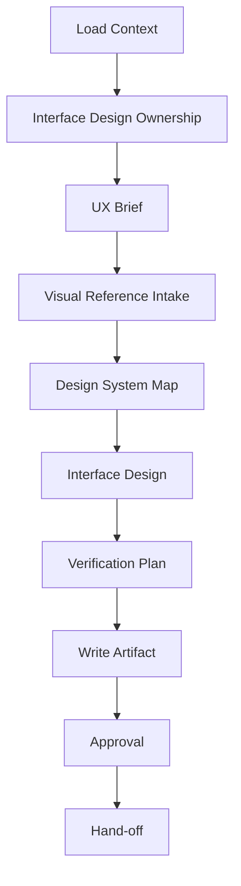

# UI Design - Interface Contract From Requirements

Turn product requirements into an interface design contract that an implementer
can build without improvising visual style, interaction states, responsive
behavior, or accessibility expectations.

This skill is for product UI/UX design, not technical architecture. It writes
`interface-design.md` for the slug. It writes or updates project-level
`DESIGN.md` only when explicitly requested with `--write-design-md` or when the
user plainly asks for a persistent design-system contract.

Before designing, read `../../PRINCIPLES.md`, `../../LANGUAGE.md`, and
`../../WORKFLOW-CONTRACTS.md` at the plugin root. Use the shared terms
precisely, especially "design drift", "falsifiable hypothesis", and
"blast radius". Use `WORKFLOW-CONTRACTS.md` for human approval routing.

## Arguments

Raw: `$ARGUMENTS`

Parse:
- Optional leading `--slug <name>`. Default slug: `current`.
- Optional `--write-design-md` flag -> update or create root `DESIGN.md`.
- Remaining text -> extra design focus, supplied brand notes, target surface,
  or user-experience concern.

## Workflow

Track progress with a visible checklist and update it after context load,
ownership handling, UX brief, visual reference intake, design-system mapping,
interface design, verification plan, artifact write, approval, and hand-off.

### Step 1: Load Context

1. Resolve artifact dir `.idea-to-ship/<slug>/`.
2. Require `requirements.md` to exist. If missing, stop and tell the user to
   run `/brainstorm --slug <slug>` first.
3. Read `requirements.md` fully.
4. Read `architecture.md` if present. Treat it as technical context, not as a
   substitute for user tasks.
5. Read existing `.idea-to-ship/<slug>/interface-design.md` if present. This
   run is a revision unless the user explicitly approves starting over.
6. Read project-level `DESIGN.md` if present. Treat it as the visual system
   source of truth unless it conflicts with actual shipped UI.
7. Read `../../WORKFLOW-CONTRACTS.md`, especially **Human Approval Routing**.
8. Explore the repo for UI evidence:
   - Component libraries: `components`, `ui`, `design-system`, Storybook.
   - Tokens and styling: CSS variables, Tailwind config, theme files, icon
     libraries, spacing/typography helpers.
   - Existing screens with similar information density, navigation, forms,
     tables, empty states, loading states, and errors.
   Use concrete file paths. The design must fit the repo, not an imagined app.

### Step 1.5: Interface Design Ownership

`interface-design.md` is the canonical UI/UX contract for this slug. `/ui-design`
owns its generated structure, but humans may edit decisions, open questions,
or known gaps.

On rerun:

1. Preserve stable section names, flow names, component names, and decision
   history unless source requirements changed.
2. Update known sections by heading instead of rewriting the whole file.
3. Preserve human notes, manually accepted tradeoffs, screenshots, known gaps,
   and prior review findings.
4. If the existing file cannot be safely merged because it lacks the expected
   headings or contains unstructured human content, write
   `interface-design.draft.md` or use `../../WORKFLOW-CONTRACTS.md` § Human
   Approval Routing before replacing `interface-design.md`.
5. If the user asks to start over, summarize what will be discarded and use
   `../../WORKFLOW-CONTRACTS.md` § Human Approval Routing to obtain explicit
   approval before replacing the canonical file.

### Step 2: UX Brief And Task Model

Derive the interface problem from `requirements.md`:

- Primary users and their goals.
- Core tasks, task frequency, and success criteria.
- Context of use: device class, environment, urgency, data density.
- Non-goals and intentionally unsupported flows.
- Falsifiable UX hypotheses: what should become easier, faster, safer, or less
  error-prone if this design is correct.

If the requirements are too thin to identify users, tasks, or success criteria,
stop and send the user back to `/brainstorm --slug <slug>`. Do not invent a
persona or workflow to make the artifact look complete.

### Step 2.5: Visual Reference Intake

When the user supplies screenshots, image files, mood boards, competitor
captures, exported mockups, or a folder of visual assets, turn them into
structured evidence before designing. A pile of images is not a design spec.

If images are attached or available by local path, inspect them with the
available image-viewing or screenshot tooling. If images are only described but
not accessible, ask for paths, a zip/folder location, or a short inventory.
Do not infer fine visual details from inaccessible images.

Create a visual reference inventory:

Use `../../templates/visual-reference-inventory.md`.

Use these roles:
- `target`: the user wants this matched closely for a specific surface.
- `current-ui`: existing product screenshot; treat as shipped UI evidence.
- `brand`: visual identity, tone, logo, photography, or campaign direction.
- `competitor`: market convention reference, not something to copy blindly.
- `inspiration`: aesthetic direction only; lower authority than repo UI.
- `asset`: an image to reuse directly, such as logo, product photo, icon, or
  illustration.
- `avoid`: a negative reference; preserve what not to do.

For each image, extract only implementable constraints:
- Layout: grid, region hierarchy, density, alignment, whitespace, aspect ratios.
- Components: buttons, inputs, tabs, cards, tables, charts, navigation, dialogs.
- States: hover, focus, selected, disabled, empty, loading, error, success.
- Color: token role or semantic usage; raw hex only when no token exists.
- Typography: scale, weight, hierarchy, line length, casing.
- Imagery/icons: style, crop, subject matter, reuse rights or asset path.
- Motion/depth: only if the image implies a state transition or layer model.

Conflict rules:
- Project `DESIGN.md` and shipped UI outrank loose inspiration images.
- A user-labeled `target` image outranks generic inspiration for the named
  surface only.
- Do not average incompatible images into a collage style. Cluster references
  by role and choose one dominant direction per surface.
- If references conflict, record the conflict and make a recommendation instead
  of silently mixing styles.
- If an image is beautiful but irrelevant to the task model, classify it as
  `inspiration` or `avoid`; do not let it drive component choices.

### Step 3: Design System Map

Map what the implementation should reuse:

- Tokens: color roles, typography scale, spacing, radius, shadows/elevation,
  motion, z-index/depth.
- Components: buttons, inputs, selects, dialogs, drawers, tables, cards,
  navigation, toasts, empty states, skeletons, charts, icons.
- States: default, hover, active, focus, disabled, loading, selected, error,
  success, empty, partial, offline if relevant.
- Do / Don't constraints from existing UI and `DESIGN.md`.
- Known gaps: missing tokens, uncertain brand rules, proprietary fonts, states
  not observed, screenshots not available.

Use raw hex values only as evidence or when no token exists. If a new token or
component variant is needed, name it as a recommendation, not as a silent fact.

### Step 4: Interface Design

Design the actual screen or flow:

- Information architecture: page regions, navigation, hierarchy, data grouping.
- Component decisions: which existing components to use and why.
- Interaction details: triggers, focus movement, keyboard behavior, undo/exit,
  validation timing, confirmations, optimistic/pessimistic behavior.
- Content design: labels, helper text, empty/error copy, button names. Keep UI
  text functional and domain-specific; do not add in-app instructional prose
  that explains the feature to itself.
- Visual direction: density, rhythm, contrast, alignment, icon usage, imagery
  or chart usage when the domain warrants it.

The output must be specific enough for `/implement` to follow, but it should
not prescribe private helper names or line-level implementation details.

### Step 5: Accessibility, Responsive, And Verification Plan

Every UI design must define gates an implementer can verify:

- Accessibility: keyboard path, focus states, labels, contrast, error
  association, semantic roles, reduced motion, screen-reader announcements.
- Responsive behavior: named breakpoints, layout changes, overflow behavior,
  touch targets, fixed-format elements with stable dimensions.
- Visual QA: screenshots to capture, viewports to test, key states to inspect,
  and any visual-regression baseline needed.
- UX metrics when relevant: task success, time on task, error rate, adoption,
  retention, or qualitative usability-test prompts.

### Step 6: Write `interface-design.md`

Write or update:

Use `../../templates/interface-design.md`. It must include Summary, UX Brief,
Existing UI / Design System Map, Visual References, Image-Derived Constraints,
Visual Contract, Interaction Spec, Component Spec, Responsive Spec,
Accessibility Contract, Visual QA Plan, UX Measurement, Design Decisions, and
Open Questions.

### Step 7: Optional Project `DESIGN.md`

Only when `--write-design-md` is present or the user explicitly asks for a
project-level design contract:

1. Read existing `DESIGN.md`, if any.
2. Preserve human-owned sections and brand decisions.
3. Write `DESIGN.md` only if it can be merged safely; otherwise write
   `DESIGN.draft.md` or use Human Approval Routing before replacement.
4. Keep it project-level: visual mood, tokens, typography, components, states,
   layout, Do / Don't, responsive rules, accessibility defaults, known gaps.
   Do not put feature-specific flow details there; those belong in
   `interface-design.md`.

### Step 7.5: Interface Design Approval

Apply `../../WORKFLOW-CONTRACTS.md` § Human Approval Routing to
`interface-design.md` before hand-off.

- If a Plannotator gate is available, use it to approve
  `interface-design.md`. Prefer `plannotator annotate
  .idea-to-ship/<slug>/interface-design.md --render-html --gate` when rendered
  design review is supported; otherwise use `plannotator annotate
  .idea-to-ship/<slug>/interface-design.md --gate`.
- If current-conversation bypass is active, skip the Plannotator gate and
  record `**Approval:** bypassed-current-conversation`.
- If denied, revise from Plannotator feedback and re-gate. Stop with
  `needs_user` if the denial changes product scope, contradicts
  `requirements.md`, or requires an architecture change.
- Record approval source, date, decision, and any denial/revision summary in
  the `**Approval:**` field or a short `## Approval History` section.
- If Plannotator is unavailable, leave `**Approval:** pending` and ask the
  user directly only when an approval decision is needed before continuing.

### Step 8: Hand-off

1. Print a concise summary: chosen visual direction, components to reuse,
   highest-risk UX decision, verification gates, open questions.
2. Tell the user:
   - Run `/architect` if technical architecture has not been written yet.
   - Run `/implement` when ready; it must treat `interface-design.md` as a
     design contract for UI changes.
   - Run `/test` for story, accessibility, and visual verification coverage.

## Phase Gates

- **⛔ GATE after Step 1.5 (Interface Design Ownership):** Existing
  `interface-design.md` content must be preserved, merged by heading, drafted
  around with `interface-design.draft.md`, or have explicit approval through
  Human Approval Routing before writing.
- **⛔ GATE after Step 2 (UX Brief):** Users, primary tasks, context of use,
  success criteria, and falsifiable UX hypotheses must be concrete enough to
  design against. If not, stop and send the user back to `/brainstorm`.
- **⛔ GATE after Step 2.5 (Visual Reference Intake):** If images were supplied,
  every image must be inventoried with a role, extracted constraints, and either
  a mapped surface/state or a reason it is not usable. Conflicting references
  must be resolved or recorded before writing the Visual Contract.
- **⛔ GATE after Step 3 (Design System Map):** The design must cite concrete
  UI evidence paths, reusable tokens, reusable components, states, and known
  gaps. If no UI system exists, say that explicitly and define the smallest
  new contract needed.
- **⛔ GATE after Step 5 (Verification Plan):** Accessibility, responsive
  behavior, interaction states, and visual QA must be verifiable. If a gate
  cannot be verified in the repo's current tooling, record the gap and the
  minimum manual check required.
- **⛔ GATE before Step 7 (`DESIGN.md`):** Project-level `DESIGN.md` may only be
  written when explicitly requested and must not absorb feature-specific flow
  details from `interface-design.md`.
- **⛔ GATE after Step 7.5 (Interface Design Approval):** If a Plannotator gate
  is available and denies `interface-design.md`, do not hand off to
  `/implement` until the denial is resolved, recorded as a scope-changing
  blocker, or explicitly handled through Human Approval Routing.

## Related Skills

- `$idea-to-ship:brainstorm` writes the product requirements this design must serve.
- `$idea-to-ship:architect` supplies technical context and consumes UI constraints.
- `$idea-to-ship:implement` consumes `interface-design.md` for UI stages.
- `$idea-to-ship:visual-test` verifies visual QA expectations from this artifact.

## Anti-Patterns

- **Aesthetic prompt dump.** Writing adjectives like "modern, polished,
  beautiful" without tokens, components, states, or constraints.
- **Screenshot cosplay.** Copying the look of a famous product while ignoring
  this repo's existing components, density, data model, and user tasks.
- **Mood-board averaging.** Treating a pile of unrelated images as one coherent
  direction. Assign roles, cluster references, and reject conflicts explicitly.
- **Static-only design.** Specifying only the happy-path screen and omitting
  loading, empty, error, disabled, focus, and responsive states.
- **Decorative drift.** Adding gradients, oversized cards, hero layouts, or
  one-off colors that do not serve the workflow or design system.
- **Accessibility as afterthought.** Treating keyboard, focus, labels, and
  contrast as QA cleanup instead of part of the design contract.

## Notes

- Use project `DESIGN.md` as a persistent visual contract when present. If it
  conflicts with shipped UI, record the conflict under Known Gaps.
- For web UIs, prefer existing design systems and platform conventions over
  invented widgets. For native UI, use the platform's human-interface guidance.
- If the user supplies a Figma URL, route through the available Figma skill or
  Figma tooling first, then adapt that context to the repo's component system.
  If Figma tooling is unavailable, ask for a screenshot/export or continue only
  from repo-local evidence and record the limitation under Known Gaps.
