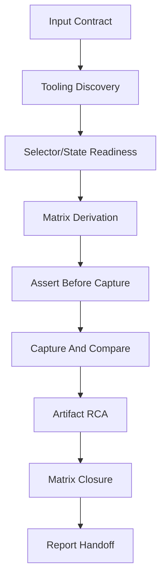

# Visual Test - Artifact-First Frontend QA

Run frontend visual verification for an idea-to-ship slug without dumping large
Playwright, CI, trace, video, screenshot, or HTML artifacts into context. The
skill turns `interface-design.md` Visual QA expectations and optional
`test-plan.md` UI rows into selector/state recipes, a coverage matrix, bounded
artifact RCA, and a final `visual-test-report.md`.

Use this skill after UI implementation, before `$idea-to-ship:review-code`, or
when review finds missing visual evidence. It does not add Playwright, Storybook,
browser tooling, baselines, or production code.

## Arguments

Raw: `$ARGUMENTS`

Parse:

- Optional leading `--slug <name>`. Default slug: `current`.
- Optional `--baseline compare|create-requested|update-requested`. Default:
  `compare`.
- Remaining text -> app root, local URL, CI artifact path, browser project, or
  focus area.

## Outputs

Write or update these files under `.idea-to-ship/<slug>/`:

- `visual-test-selectors.md` from `../../templates/visual-test-selectors.md`.
- `visual-test-matrix.md` from `../../templates/visual-test-matrix.md`.
- `visual-artifact-rca.md` from `../../templates/visual-artifact-rca.md`.
- `visual-test-report.md` from `../../templates/visual-test-report.md`.

Track progress with a visible checklist and update status after every gate.
If a gate blocks, record the blocked status in the relevant artifact before
asking the user for approval or missing inputs.

## Artifact Ownership

On rerun, preserve stable matrix `cell_id` values, selector recipes, baseline
approval records, human notes, prior evidence links, and known accepted skips
unless the source requirement, interface contract, route/state, or test scenario
changed. Update artifacts by section or `cell_id` rather than rewriting the
whole file. If an existing artifact cannot be merged safely because it lacks the
expected headings or contains unstructured human content, write a draft artifact
such as `visual-test-report.draft.md` or ask before replacing the canonical
file.

## Workflow

### Gate 1 - Input Contract

Resolve `.idea-to-ship/<slug>/`. Require `requirements.md`. If missing, stop
and tell the user to run `/brainstorm --slug <slug>` first. Read
`requirements.md`, then read `interface-design.md` when present and
`test-plan.md` when present. If `interface-design.md` is missing, the run may
continue only for an explicit visual-check request; the report must say
design-contract compliance is not claimable.

### Gate 2 - Tooling Discovery

Inspect the repo for existing Playwright, Storybook, browser, screenshot, or CI
artifact workflows. Use existing commands and paths only. If tooling is absent,
record manual-evidence mode and stop before inventing screenshots or baselines.

### Gate 3 - Selector/State Readiness

Write `visual-test-selectors.md`. Prefer stable role, label, and test-id
selectors. Record auth/session setup, seed data, route preconditions, ready
state, loading completion, reduced-motion or animation controls, known flaky
states, and rejected brittle selectors.

### Gate 4 - Matrix Derivation

Write `visual-test-matrix.md`. Every required Visual QA source from
`interface-design.md` and UI scenario row from `test-plan.md` maps to a required
cell or an explicit de-scope decision with approver/source and rationale.
`SKIP-with-reason` is not success for required coverage unless that de-scope is
recorded.

Matrix statuses are `PASS`, `FAIL`, `FLAKY`, `MISS`, `NEEDS-RUN`, and
`SKIP-with-reason`.

### Gate 5 - Assert Before Capture

Every screenshot cell must name an `assertion_command` or equivalent check that
proves the page, route, component state, data, and loading state are ready before
capture. A screenshot captured before loaded state is `FAIL`, not evidence.

### Gate 6 - Capture And Compare

Record screenshot path, baseline path, baseline mode, `git_status_snapshot`,
`workspace_diff_fingerprint`, and `untracked_files_manifest`.

Compute `workspace_diff_fingerprint` from content, not stats:

1. Collect tracked status with `git status --porcelain=v1 -z --untracked-files=no`,
   excluding this slug's visual evidence artifacts from the hash input.
2. Collect unstaged content with
   `git diff --binary --full-index --no-ext-diff --no-color`, excluding this
   slug's visual evidence artifacts (`visual-test-selectors.md`,
   `visual-test-matrix.md`, `visual-artifact-rca.md`, and
   `visual-test-report.md`) from the hash input.
3. Collect staged content with
   `git diff --cached --binary --full-index --no-ext-diff --no-color`, using
   the same visual evidence artifact exclusions.
4. Enumerate untracked files with `git ls-files --others --exclude-standard -z`.
5. NUL-decode and sort untracked paths by byte-stable path order.
6. Classify every untracked file, including nested files, as either
   content-hashed relevant input or excluded with rationale. This slug's visual
   evidence artifacts are excluded from the fingerprint with rationale
   `self evidence artifact`, so writing the report cannot make its own
   fingerprint stale.
7. Build the SHA-256 input in this order: tracked status, unstaged diff, staged
   diff, then each sorted untracked manifest entry with path, classification,
   file-content SHA-256 for relevant files, or exclusion rationale for excluded
   files.

Unclassified untracked files block aggregate `PASS`.

Console/network statuses are `PASS`, `FAIL`, `NOT_COLLECTED`, and
`IGNORED-with-justification`. `NOT_COLLECTED` yields `NEEDS_USER`.
`IGNORED-with-justification` needs justification, RCA link, and owner/source.

Baseline modes:

- `compare`: default. Missing approved baseline makes required cells `MISS` or
  the run `NEEDS_USER`.
- `create-requested`: writes an approval request; it does not bless the current
  UI.
- `update-requested`: writes before/after artifacts and rationale; it never
  updates baselines silently.

The visual-test agent cannot self-approve baseline approval. Approval requires
approver/source, date, baseline path, diff summary, before artifact, after
artifact, linked matrix cells, and rationale.

### Gate 7 - Artifact RCA

Write `visual-artifact-rca.md` for failures, flakes, large CI artifacts, and
Playwright report references. Summarize by bounded artifact path or redacted URL,
test id/title, project/browser, retry index, trace step/action or
screenshot/video filename, timestamp, inspected anchor range, snippet cap,
redaction notes, linked matrix cells, failure classification, suspected cause,
and next action.

Do not paste raw logs, full HTML reports, traces, videos, screenshots, cookies,
auth state, signed artifact URLs, query-string tokens, or secret-bearing
snippets into the report.

### Gate 8 - Matrix Closure

No required cell may remain blank. Aggregate verdict values are `PASS`, `FAIL`,
and `NEEDS_USER`.

Aggregate `PASS` requires every required cell to be `PASS`, each pass to be
fresh or a valid carried-forward `PASS`, matching `workspace_diff_fingerprint`,
approved baselines, no unclassified untracked files, no unresolved artifact RCA,
and report-level console/network status of `PASS` or complete
`IGNORED-with-justification`.

Required `FAIL`, `FLAKY`, report-level console/network `FAIL`, or unresolved
product/test RCA yields `FAIL`. `MISS`, `NEEDS-RUN`, non-de-scoped
`SKIP-with-reason`, stale fingerprint, missing baseline approval,
`NOT_COLLECTED`, incomplete `IGNORED-with-justification`, or unclassified
untracked files yields `NEEDS_USER`.

### Gate 9 - Report Handoff

Write `visual-test-report.md` with `aggregate_verdict`, `blocking_reasons`,
matrix status counts, `workspace_diff_fingerprint`, `untracked_files_manifest`,
baseline approval summary, report-level `console_status`, `network_status`,
artifact RCA summary, residual risk, and next action. This report is the handoff
for `$idea-to-ship:review-code`.

## Related Skills

- `$idea-to-ship:ui-design` writes the source `interface-design.md` Visual QA
  contract.
- `$idea-to-ship:test` writes story and UI scenario coverage.
- `$idea-to-ship:review-code` consumes visual-test evidence and flags missing
  matrix evidence, stale fingerprints, weak artifact anchors, unresolved visual
  failures, and missing baseline approval.
