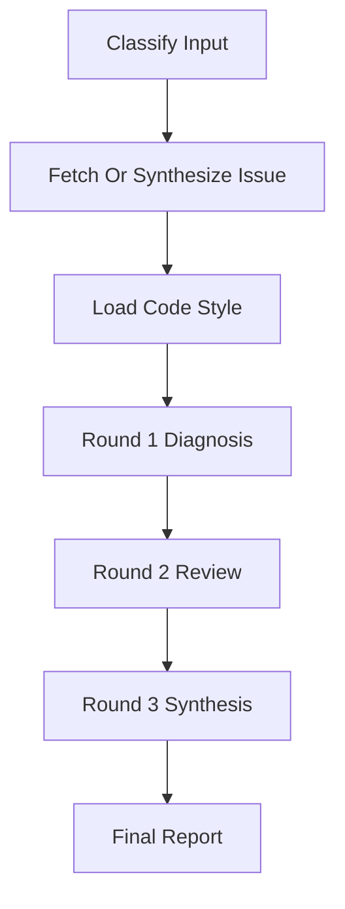

# Evaluate GitHub Issue

Evaluate a GitHub issue against the current repository codebase.

## Arguments

The user provided: `$ARGUMENTS`

This is one of:
- A GitHub issue URL (e.g. `https://github.com/owner/repo/issues/123`)
- An issue number (e.g. `123` or `#123`) — assumes the current repo
- **A free-form natural-language description** of the issue to evaluate (e.g. "点击登录按钮后有时会 401，token 刷新没生效"). In this mode there is no real GitHub issue; the description itself is the input.

## Multi-Agent Review Routing

Before launching any review or diagnosis agent, read `../../PRINCIPLES.md` and
`../../WORKFLOW-CONTRACTS.md`. Apply the shared **Multi-Agent Review Routing**
contract and § Issue Contribution Gate to the adversarial diagnosis review and
synthesis phases. The roles for this workflow are `ROUND_1_CODE_ANALYSIS`,
`ROUND_1_HISTORY_CHECK`, `ROUND_1_INDEPENDENT_CHECK`,
`ROUND_2_ADVERSARIAL_REVIEW:<ANGLE>`, and `ROUND_3_SYNTHESIS`.

Round 2 and Round 3 are review-related gates. They are pre-authorized to launch
reviewer and synthesis sub-agents. Fall back to same-context review only when
reviewer sub-agents are explicitly unsupported by the host/runtime, the user
explicitly forbids them, or the selected reviewer/model is explicitly
unavailable or at capacity. In degraded mode, record
`degraded-same-context-review`, preserve the same angles and rounds
sequentially in the main context, and do not present the result as independent
multi-agent review.

## Workflow

Execute the following steps in order. Use parallel agents where indicated.
Track status through input classification, issue fetch, code-style context,
diagnosis rounds, synthesis, and final report.



### Prompt & Template Artifacts

Before using any extracted prompt or template artifact, read the referenced
file. If it is missing or empty, stop with a terminal error. Do not reconstruct
the missing prompt/template from memory, this skill body, or prior runs.
Do not improvise a replacement prompt/template.

Artifacts used by this skill:
- `../../prompts/evaluate-issue-round2-adversarial.md`
- `../../prompts/evaluate-issue-round3-synthesis.md`
- `../../templates/evaluate-issue-final-report.md`

### Step 0: Classify Input Mode

Decide which mode `$ARGUMENTS` falls into:

- **ID mode** — matches a URL regex (`github\.com/.+/issues/\d+`) or is a bare/`#`-prefixed integer. Proceed to Step 1 as written.
- **Description mode** — anything else (or `$ARGUMENTS` is empty). Skip Step 1's fetch and run this sub-flow instead:

  1. **Clarity check.** Read the description and ask: is it specific enough to diagnose? It is specific enough if it identifies (a) the observed wrong behavior AND (b) at least one of: trigger / affected area / error signal. It is NOT specific enough if it is one vague phrase (e.g. "登录有问题", "fix the bug", "something is off with the API").
  2. **If ambiguous**, use `AskUserQuestion` to gather up to 3 missing facts in a single call. Prefer questions with concrete options when possible (e.g. "Which area?", "When does it happen?"). Always include a free-text "Other" path for specifics. Do NOT invent facts; if the user's answers are still vague, ask once more, then proceed with what you have and clearly flag the remaining unknowns in the final report.
  3. **Fix-ready bar.** If the description still lacks concrete observed
     behavior plus a trigger, error signal, or affected area, return
     `needs_user` with the missing evidence instead of producing a fix plan.
  4. **Synthesize a pseudo-issue** from the description (+ any clarifications):
     ```
     PSEUDO_ISSUE_TITLE = <one-line summary of the problem, derived from the description>
     PSEUDO_ISSUE_BODY  = <description + clarifications, lightly cleaned up>
     PSEUDO_ISSUE_NUMBER = "desc"   # used wherever the pipeline expects an issue number
     ```
     Use these values anywhere the downstream steps reference `<issue-title>`, `<issue-body>`, `<issue-number>`, or issue comments. There are no real comments in this mode — treat the comment field as empty.
  5. Skip Step 1 entirely. All other steps (code style analysis, three-round diagnosis, report) run unchanged against the pseudo-issue.
  6. In the final report (Step 4), add a header line: `**Mode**: description-based evaluation (no GitHub issue)` so the user sees this wasn't a real issue fetch.

### Step 1: Fetch Issue Details

Use `gh issue view` to fetch the full issue details including title, body, labels, and comments.

- If a full URL is provided, extract the owner/repo and issue number, then run:
  Replace `<number>` and `<owner/repo>` with the parsed issue target.
  ```bash
  gh issue view <number> --repo <owner/repo> --json title,body,labels,comments,state,createdAt,updatedAt
  ```
- If only a number is provided, assume the current repo:
  ```bash
  gh issue view <number> --json title,body,labels,comments,state,createdAt,updatedAt
  ```

### Step 2: Code Style Analysis (First Run Only)

Apply `../../WORKFLOW-CONTRACTS.md` § Code Style Guide Lifecycle:

1. Resolve `<data-dir>/<owner>/<repo>/code-style.md`.
2. If the guide is missing, run Full Regeneration before diagnosis.
3. If the guide exists, run the Freshness Check. If stale, launch regeneration
   in the background when possible and continue with the existing guide.

### Step 3: Three-Round Diagnosis & Fix Plan

This diagnosis follows a **three-round sequential pipeline**. Each round builds on the previous round's output to produce an increasingly validated analysis and fix plan.

---

#### Round 1 — Multi-Agent Diagnosis + Static Analysis

Launch the following agents and tools **all in parallel**:

**Agent 1A — Code Analysis (`ROUND_1_CODE_ANALYSIS`; Claude: Sonnet, non-Claude: native analysis sub-agent):**
- Based on the issue description, search the codebase for the relevant code paths
- Determine whether the reported issue can be confirmed from the code
- Identify the root cause if the issue exists
- Propose a concrete fix plan with specific files, lines, and changes
- Report: confirmed/unconfirmed, affected files and lines, root cause analysis, proposed fix

**Agent 1B — Commit History Check (`ROUND_1_HISTORY_CHECK`; Claude: Sonnet, non-Claude: native analysis sub-agent):**
- Search git log for commits that may have already fixed this issue:
  Replace the angle-bracket placeholders with the parsed issue number and key
  search terms.
  ```bash
  git log --all --oneline --grep="<issue-number>"
  git log --all --oneline --grep="<key-terms-from-issue>"
  ```
- Check if any recent commits touch the affected code paths
- If a potential fix commit is found, verify whether it actually addresses the issue
- Report: fixed/not-fixed, relevant commits if any

**Agent 1C — Independent Diagnosis (`ROUND_1_INDEPENDENT_CHECK`; Claude: Haiku, non-Claude: native independent sub-agent):**

Launch an independent third perspective. In Claude Code use a Haiku agent; in non-Claude runtimes use a separate sub-agent with no access to the first two agents' conclusions. Provide it with the issue details and instruct it to search the codebase independently:

"You are an independent code analyst. Based on this issue, search the codebase for relevant code paths, identify the root cause, and propose a fix plan. Report: confirmed/unconfirmed, affected files and lines, root cause analysis, proposed fix. Be concise."

**Tool 1D — IDE Diagnostics:**

Call `mcp__ide__getDiagnostics` to collect compiler/linter diagnostics for the current project. These are objective, machine-verified findings that may be related to the reported issue (type errors, unused imports, syntax issues, etc.). If the issue mentions specific files, filter diagnostics to those files.

**Wait for all Round 1 agents and diagnostics to complete.** Collect:
- `ROUND_1_PRIMARY` — output from Agent 1A + 1B
- `ROUND_1_INDEPENDENT` — output from Agent 1C
- `ROUND_1_DIAGNOSTICS` — output from Tool 1D
- `ROUND_1_DIAGNOSIS` = all of the above combined

---

#### Round 2 — Multi-Angle Adversarial Review of Diagnosis

**This round must wait for Round 1 to complete.** Launch adversarial reviewers
for separate diagnosis-review angles. In Claude Code, use Codex rescue and/or
native review agents when available. In non-Claude runtimes, use the host's
native sub-agent mechanism and assign each output
`ROUND_2_ADVERSARIAL_REVIEW:<ANGLE>`.

Required angles:

- `ROOT_CAUSE`: validate the causal chain and code-path evidence
- `FIX_PLAN_TESTABILITY`: validate the proposed fix, tests, and verification
- `REGRESSION_SCOPE`: validate scope control, regressions, and already-fixed
  claims

Use `../../prompts/evaluate-issue-round2-adversarial.md` for each angle,
filling in the assigned angle, issue details, compact code style checklist,
Round 1 outputs, and IDE diagnostics.

**Wait for all Round 2 angles to complete.** Collect their outputs as
`ROUND_2_DIAGNOSIS`, grouped by angle.

---

#### Round 3 — Final Synthesis

Launch a single final synthesis agent. In Claude Code, use an **Opus agent** (`model: "opus"`) as the final arbiter. In non-Claude runtimes, use a fresh synthesis sub-agent. This is issue diagnosis, but Round 3 synthesizes adversarial review evidence; fall back to same-context synthesis only when synthesis/reviewer sub-agents are explicitly unsupported by the host/runtime, the user explicitly forbids them, or the selected synthesis reviewer/model is explicitly unavailable or at capacity. Record `degraded-same-context-review` before any final recommendation and do not present a main-context synthesis as independent review.

Use `../../prompts/evaluate-issue-round3-synthesis.md` for the synthesis agent,
filling in issue details, Round 1 outputs, IDE diagnostics, and
`ROUND_2_DIAGNOSIS`.

**Wait for Round 3 to complete.**

### Step 4: Present Final Report

Take the Round 3 agent's output and present it using
`../../templates/evaluate-issue-final-report.md`, filling in the issue header,
review mode, degradation reason, diagnosis pipeline, and Round 3 structured
output. In description mode, include the template's description-based
evaluation mode line.

### Step 5: Prompt for Next Steps

After presenting the report, tell the user:
- If the issue is confirmed and not fixed: "I can implement the fix now, or you can review the plan first. After the fix is applied, run `/review-fix` to get an adversarial review against the repo's code style."
- If the issue is already fixed: "This issue appears to be fixed in commit <sha>. No further action needed."
- If the issue cannot be confirmed: "I could not confirm this issue in the current codebase. The issue may be environment-specific, already fixed, or require additional context."

## Related Skills

- `$issue-evaluator:fix-issue` applies a confirmed narrow fix.
- `$issue-evaluator:review-fix` reviews local changes after a fix.

## Anti-Patterns

- **Confirmation bias.** Deciding the root cause before reading the code, then finding "evidence" that supports it. Let the code lead. If Round 1 and Round 2 disagree, that's a signal — don't just pick the first answer.
- **Surface-level diagnosis.** "The error is on line 42" without explaining *why* it fails. A diagnosis must include the causal chain: what triggers the code path, what state is wrong, and why.
- **Unfalsifiable hypotheses.** "It might be a race condition" without stating a concrete check. Use the falsifiable hypothesis pattern: "If X is the cause, then doing Y will produce Z." If you can't state the prediction, dig deeper.

## Phase Gates

- **⛔ GATE after Step 1 (Fetch) / Step 0 (Description mode):** You must have a clear problem statement. In description mode, if the description is too vague after two rounds of clarification, stop and tell the user — do not proceed with a vague diagnosis.
- **⛔ GATE after Round 1:** At least two agents must have produced findings before proceeding to Round 2. If all agents returned empty results, something is wrong with the issue or the search scope — surface this rather than sending empty context to the adversarial reviewer.

## Notes

- Always use `gh` CLI for GitHub interactions, not web fetch
- Keep the code style analysis focused and concise — it's a reference doc, not a novel
- When searching for root cause, prioritize understanding over breadth
- Provide actionable reproduction steps that the user can run immediately
- The fix plan should be specific enough to implement directly
- **Scope discipline**: When implementing a fix, only modify code that is directly related to the issue. Do NOT fix lint warnings, style issues, or formatting problems in surrounding or unrelated code — even if they are obvious. The goal is a minimal, focused fix. Unrelated cleanups create noise in diffs and risk introducing regressions.
