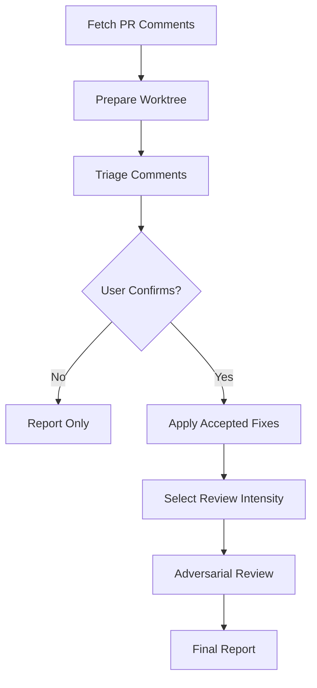

# Triage & Address PR Review Comments (Read-Only)

After a GitHub pull request has accumulated review comments, walk through every reviewer comment, **evaluate whether it's a reasonable change request**, and:

- For comments that **are** worth addressing → apply the fix as **uncommitted local edits** in an isolated worktree, so the user can inspect and decide what to do next.
- For comments that **are not** worth addressing → produce a justified rebuttal the user can paste back manually.

This skill is **strictly read-only with respect to GitHub** and **never creates a commit**. The user is the one who decides whether to commit, push, or post anything.

Local write boundary: this skill may create a detached scratch worktree and
leave unstaged edits there after the user confirms the triage plan. It does not
write reports to the repository, stage files, commit, push, or mutate GitHub.

## CRITICAL SAFETY RULES

**1. Never write to GitHub.** This means:
- Do NOT run `gh pr review`, `gh pr comment`, `gh pr edit`, `gh pr merge`, `gh pr close`, `gh pr ready`, `gh pr resolve`, etc.
- Do NOT run `gh api` with `POST` / `PUT` / `PATCH` / `DELETE` against the PR or its discussions
- Do NOT post replies, resolve threads, add reactions, change labels, request reviewers, or modify state in any way
- Only use `gh` for **read-only** operations (fetching PR details, diff, comments, reviews, files)
- All rebuttal text goes to the conversation — never to GitHub

**2. Never create a commit.** This means:
- Do NOT run `git commit`, `git commit --amend`, `git stash`, `git push`, or anything that records history
- Do NOT run `git add` either — the changes should remain visible as unstaged edits so the user can review with `git diff`
- File edits go into an **isolated worktree** (so the user's working copy is not disturbed) and stay as **uncommitted, unstaged** modifications
- The user is the only one who decides whether to stage, commit, or discard

These two rules apply throughout the entire workflow, including any sub-agents launched by this skill.

## Arguments

The user provided: `$ARGUMENTS`

This should be one of:
- A full GitHub PR URL (e.g. `https://github.com/owner/repo/pull/123`)
- A PR number (e.g. `123` or `#123`) — assumes the current repo

Optional flag:
- `--include-resolved` — also evaluate comments on already-resolved threads (default: skip them)
- `--review-depth quick|standard|deep` — force the post-fix review intensity
  and record it in the final report. Without it, auto-select by risk.

## Multi-Agent Review Routing

Before launching analysis, executor, or adversarial review agents, read
`../../PRINCIPLES.md` and `../../WORKFLOW-CONTRACTS.md`. Apply Review Intensity Selection,
Multi-Agent Review Routing, and the Output/Token/Error contract.
Roles are `ANALYST`, `RECONCILER`, `EXECUTOR`, and
`ADVERSARIAL_REVIEWER:<ANGLE>` for selected `standard` and `deep`. Keep the
human gate before edits, keep review read-only, and fail loud on skipped
comments or checks.

The adversarial review phase is pre-authorized for reviewer sub-agents when
selected intensity is `standard` or `deep`; selected `quick` is not degraded.
Fall back to `degraded-same-context-review` only for explicit unsupported,
forbidden, or unavailable/capacity cases, and never present it as independent.

## Workflow



### Step 1: Parse Arguments & Fetch PR Context

1. Parse the PR number and optional `owner/repo` from `$ARGUMENTS`.
   - If a full URL is provided, extract the owner/repo and PR number.
   - If only a number is provided, use the current repo.
   - Note whether `--include-resolved` was passed.

2. Fetch PR metadata, diff, and all comment streams in parallel using `gh` (read-only):

   **A — PR metadata:**
   Replace `<number>` and `<owner/repo>` placeholders before running.
   ```bash
   gh pr view <number> [--repo <owner/repo>] --json number,title,body,author,state,baseRefName,headRefName,headRepositoryOwner,headRepository,files,additions,deletions,reviewDecision,reviews,comments,createdAt,updatedAt,url,isCrossRepository
   ```
   Capture: `title`, `body`, `author.login`, `state`, `baseRefName`, `headRefName`, `url`, `isCrossRepository`, `reviewDecision`.

   **B — PR diff:**
   Replace `<number>` and `<owner/repo>` placeholders before running.
   ```bash
   gh pr diff <number> [--repo <owner/repo>]
   ```
   Used for evaluating whether each inline comment is anchored to code that actually exists / behaves as the reviewer claims.

   **C — Inline review comments (anchored to code lines):**
   Replace `<number>` and `<owner/repo>` placeholders before running.
   ```bash
   gh api "repos/<owner>/<repo>/pulls/<number>/comments?per_page=100" --paginate \
     --jq '[.[] | {id, in_reply_to_id, pull_request_review_id, path, line, original_line, side, start_line, body, user: .user.login, created_at, updated_at, html_url, position, original_position, commit_id, original_commit_id}]'
   ```
   These are the per-line review comments (the most actionable kind).

   **D — Review summaries (top-level review bodies):**
   Replace `<number>` and `<owner/repo>` placeholders before running.
   ```bash
   gh api "repos/<owner>/<repo>/pulls/<number>/reviews?per_page=100" --paginate \
     --jq '[.[] | {id, user: .user.login, state, body, submitted_at, html_url}]'
   ```
   Capture the body of each review (general review notes that aren't anchored to a line).

   **E — Issue-level conversation comments (the PR conversation tab):**
   Replace `<number>` and `<owner/repo>` placeholders before running.
   ```bash
   gh api "repos/<owner>/<repo>/issues/<number>/comments?per_page=100" --paginate \
     --jq '[.[] | {id, user: .user.login, body, created_at, updated_at, html_url}]'
   ```
   These are the general PR comments (not tied to code lines).

   **F — Review threads with `isResolved` (GraphQL — needed because the REST API does not expose thread resolution):**
   Replace `<owner>`, `<repo>`, and `<number>` placeholders before running.
   ```bash
   gh api graphql -F owner=<owner> -F repo=<repo> -F number=<number> -f query='
     query($owner: String!, $repo: String!, $number: Int!) {
       repository(owner: $owner, name: $repo) {
         pullRequest(number: $number) {
           reviewThreads(first: 100) {
             nodes {
               id
               isResolved
               isOutdated
               path
               line
               comments(first: 50) {
                 nodes {
                   databaseId
                   author { login }
                   body
                   createdAt
                   url
                 }
               }
             }
           }
         }
       }
     }'
   ```
   Use this to know which inline comments belong to a **resolved** thread so they can be filtered (unless `--include-resolved` is set).

   Token budget: by default, pass analysts at most 100 inline comments, 100
   review summaries, 100 conversation comments, 25 changed files, and 400 diff
   lines per file. If the PR is larger, prioritize unresolved human review
   threads, comments on executable code, security-sensitive paths, and comments
   with explicit change requests. Set `truncated: true`, list omitted pages or
   files, and include the exact continuation query in `next_action`.

3. If the PR is closed or merged, note it in the report but proceed — the user may still want to triage stale feedback.

### Step 2: Set Up Read-Only Worktree

The fix needs somewhere to live. We use an **isolated, detached worktree** on the PR's head commit so that:
- The user's current working directory and branches are untouched.
- The edits are visible as uncommitted changes in a clearly-named scratch directory.
- There is no local branch to accidentally push.

1. Confirm we're in the right repo (skip worktree setup if cross-repo and just diff-review):
   Set `CURRENT_REPO` from read-only `gh` output before comparing it.
   ```bash
   CURRENT_REPO=$(gh repo view --json owner,name --jq '"\(.owner.login)/\(.name)"' 2>/dev/null)
   ```
   Compare with the PR's `owner/repo`. If they don't match (cross-repo PR from a fork), skip the worktree and operate in **diagnosis-only mode** — explain the rebuttals and produce a fix plan as text, but do not edit any files.

2. Determine the head ref. For same-repo PRs:
   Set `HEAD_BRANCH` from PR metadata before running these commands.
   ```bash
   HEAD_BRANCH="<headRefName from PR metadata>"
   git fetch origin "$HEAD_BRANCH"
   HEAD_REF="origin/$HEAD_BRANCH"
   ```
   For PRs from a fork in the same workflow (rare path — usually skipped above), use `gh pr checkout --detach` into the worktree instead.

3. Check for an existing worktree on this branch (so we don't fight with a previous run or the user's own checkout):
   Review before running: this command only discovers existing worktrees; do not remove or edit a discovered worktree without user confirmation.
   Set `EXISTING_WORKTREE` only from local `git worktree` output.
   ```bash
   EXISTING_WORKTREE=$(git worktree list --porcelain | grep -B2 "branch refs/heads/$HEAD_BRANCH" | grep "^worktree " | sed 's/^worktree //')
   [ -z "$EXISTING_WORKTREE" ] && EXISTING_WORKTREE=$(git worktree list | grep "$HEAD_BRANCH" | awk '{print $1}')
   ```

4. **If found**: STOP and ask whether to operate inside it or create a separate scratch worktree. Default to a separate scratch worktree unless the user explicitly chooses reuse.
   Set `WORKTREE_REUSED=true` only if the user picks reuse.

5. **If not found**: create a fresh **detached** worktree (so there's no branch to accidentally push):
   ```bash
   REPO_ROOT=$(git rev-parse --show-toplevel)
   REPO_NAME=$(basename "$REPO_ROOT")
   FIX_WORKTREE="$REPO_ROOT/../.claude-worktrees/$REPO_NAME/pr-<number>-comments"
   mkdir -p "$(dirname "$FIX_WORKTREE")"
   git worktree add --detach "$FIX_WORKTREE" "$HEAD_REF"
   WORKTREE_REUSED=false
   ```
   Detached HEAD is intentional — there is no branch and there will be no commit, so there is nothing for `git push` to send anywhere.

6. `cd` into the worktree. **All subsequent file reads and edits run inside it.**

7. **Cleanup rule**: Do **NOT** automatically remove the worktree at the end, even if we created it. The whole point is for the user to review the uncommitted edits. Tell them how to remove it manually in the final report.

### Step 3: Build the Comment Set

From the raw comment streams (Step 1 C/D/E/F), build a clean **comment-to-evaluate set**:

1. **Drop the PR author's own comments** — they're not review feedback. Keep them as **CONTEXT** for evaluating reviewer comments (e.g. "the author already explained X here").

2. **Drop bot comments** by default — Dependabot, CodeRabbit, sonar-bot, etc. (`user.type == "Bot"` or username ends in `[bot]`). The user can re-run with `--include-bots` if they want them. (If the user passes that flag, treat bot comments as a separate, lower-priority category.)

3. **Drop already-resolved threads** (from the GraphQL data in Step 1F) unless `--include-resolved` was passed.

4. **Drop pure noise** — single emoji, "+1", "LGTM" with no actionable content, "approved" with no body. Keep "approved with nits" only if there are nits to extract from the body.

5. **Group threaded replies** — for inline comments, walk `in_reply_to_id` chains and group them into one thread per top-level comment. Treat the **whole thread** as one comment-to-evaluate, with the **latest reviewer position** as the operative ask. If the PR author replied last, the operative ask is still the most recent reviewer note above their reply.

6. **Classify each remaining comment** into one of:
   - **BUG** — reviewer claims the code is broken / incorrect
   - **STYLE** — naming, formatting, idiom, convention
   - **DESIGN** — architecture, abstraction, API shape, separation of concerns
   - **PERF** — performance / memory / complexity concern
   - **SECURITY** — security or correctness-under-adversarial-input concern
   - **TEST** — missing test coverage, weak assertions, brittle test
   - **DOC** — comment / docstring / changelog request
   - **NIT** — minor preference, no real impact
   - **QUESTION** — reviewer is asking for clarification, not requesting a change

7. For each comment, record: `thread_id` (top-level inline comment id, or review id, or issue-comment id), `latest_note_id`, `author`, `category`, `location` (`file:line` if anchored, else "general"), `html_url`, full thread body, and `is_question` flag (questions get a different verdict path — they need answers, not fixes).

If after filtering the set is **empty**, stop and report:
> "No actionable review comments found on PR #<number>. Either no human review has happened yet, or all discussions are already resolved."

### Step 4: Load Code Style Guide

The triage decisions need to be grounded in this repo's actual conventions, otherwise REJECT/ACCEPT verdicts will drift.

Apply `../../WORKFLOW-CONTRACTS.md` § Code Style Guide Lifecycle:

1. Resolve the guide path.
2. Generate it if absent.
3. Run the Freshness Check if present; stale guides may regenerate in the
   background while triage proceeds with the existing guide.
4. Extract a compact checklist of at most 15 rules. Reviewer Preference Mining
   is especially important here because it indicates which current comments are
   project convention versus personal preference.

### Step 5: Triage — Evaluate Each Comment (runtime-aware analysis)

This is the central step. Each comment gets an **independent verdict** before any code is touched. In Claude Code, analysis is done by Opus because verdicts have to be load-bearing — every ACCEPT becomes a code edit, every REJECT becomes a message back to a reviewer, and the cost of getting either wrong is high. In non-Claude runtimes, use separate analysis sub-agents with the same load-bearing role.

#### Phase 1 — Per-Comment Evaluation (parallel analysts)

For each comment in the set, launch an **analyst agent** in parallel, capped at ~4 concurrent. In Claude Code this is an Opus agent (`model: "opus"`); in non-Claude runtimes use the host's native sub-agent mechanism and label the role `ANALYST`. Each agent gets:

Use `../../prompts/fix-pr-comments-analyst.md`, filling in the PR context,
thread metadata, relevant diff hunk, and surrounding code from
`<FIX_WORKTREE>`. The analyst must not edit files, commit, stage, push, or
write to GitHub.

Wait for all per-comment agents to finish. Collect into `PHASE_1_VERDICTS`.

#### Phase 2 — Cross-Comment Reconciliation (single reconciler)

Many PRs have overlapping or contradictory comments. Launch a single reconciler
agent. In Claude Code this is an Opus agent (`model: "opus"`); in non-Claude
runtimes use a fresh sub-agent with role `RECONCILER`. Use
`../../prompts/fix-pr-comments-reconciler.md` with `PHASE_1_VERDICTS`, the
compact style checklist, PR title/body, and changed-file list.

Wait for this agent. Store as `TRIAGE_REPORT` and `CONSOLIDATED_FIX_PLAN`.

### Step 6: Confirm With User Before Touching Code

Before any file is edited, present the triage table and get confirmation. The user is the final arbiter.

```markdown
## Review Comment Triage for PR #<number>: "<title>"

Found <N> actionable comments after filtering. Worktree: `<FIX_WORKTREE>`

| # | Reviewer | Location | Category | Verdict | Confidence |
|---|---|---|---|---|---|
| 1 | @alice | `src/foo.go:42` | BUG | **ACCEPT** | high |
| 2 | @bob | `src/bar.go:18` | STYLE | **REJECT** | medium |
| 3 | @carol | `src/baz.ts:101` | DESIGN | **DEFER** | high |
| ... | ... | ... | ... | ... | ... |

**Summary**: <X> to accept, <Y> to reject (with rebuttal), <Z> to defer, <W> answers, <V> need your input.

**Reminder**: I will only **edit files in the worktree**. I will NOT commit, push, or post anything to GitHub.

How would you like to proceed?
1. Apply all ACCEPT items as-is (default)
2. Show me the full rebuttal text for the REJECTs first
3. Show me the full fix plan for the ACCEPTs first
4. Let me override specific verdicts before proceeding
5. Skip the implementation entirely — just give me the report
```

Wait for the user's response. **Do not skip this step.** The whole point of this skill is human-in-the-loop validation; silently proceeding undermines that.

If the user picks option 5, jump straight to Step 10 (Final Report) without editing any files. Skip the executor (Step 7) and adversarial review (Step 8) — there's nothing to execute or review.

### Step 7: Apply the Accepted Fixes (runtime-aware executor, uncommitted)

**Execution is delegated to a separate executor.** In Claude Code this is Sonnet: Opus did the analysis, and Sonnet is faster and cheaper for the mechanical work of reading files, matching surrounding style, and applying the planned edits. In non-Claude runtimes, use a worker/executor sub-agent with the same constraints. The fix plan from Phase 2 is detailed enough that no fresh judgment is required — the executor just executes it.

Launch a single executor agent with the consolidated fix plan as input. In Claude Code this is a **Sonnet agent** (`model: "sonnet"`); in non-Claude runtimes use the host's native worker/executor sub-agent. Group all accepted items into one agent run so it can see cross-file relationships and avoid redundant file re-reads.

Use `../../prompts/fix-pr-comments-executor.md` with the PR title, scratch
worktree path, user-approved consolidated fix plan, and compact style
checklist. The executor must leave edits unstaged and must not commit, stash,
push, stage, touch the user's main working directory, or write to GitHub.

Wait for the executor to finish. Collect the result as `EXECUTOR_REPORT`. Move any `INFEASIBLE` items into the final report's "Needs Your Input" section so the user knows why those comments weren't addressed.

### Step 8: Multi-Angle Adversarial Review of the Applied Fixes

After the executor has applied the edits, select `review_intensity` using
`../../WORKFLOW-CONTRACTS.md` unless the user forced `--review-depth`. Record
`Review intensity: <tier> (<auto|forced>: <reason>)` in the final report. Then
run the selected adversarial review over the resulting diff. This is the safety
net: the reviewer is a pass after analysis and execution, and its job is to
catch cases where the executor mis-applied a plan, the plan itself was subtly
wrong, or a fix introduced a new bug.

For `quick`, run one same-context checklist over plan trace/scope,
correctness/regression/security, and completeness/tests. If it finds material
issues, surface them in the final report and ask whether to escalate.

For `standard` and `deep`, launch multiple adversarial reviewers. In Claude
Code, use Codex rescue and/or native review agents when available. In non-Claude
runtimes, use fresh sub-agents with roles `ADVERSARIAL_REVIEWER:<ANGLE>`.

Required angles:

- `PLAN_TRACE_SCOPE`: every diff hunk traces to an approved thread/fix plan;
  no scope creep
- `CORRECTNESS_REGRESSION_SECURITY`: correctness, regressions, security, API
  or data breakage
- `COMPLETENESS_TESTS`: missed plan items, test coverage, verification gaps,
  disputed upstream verdicts

Use this prompt per angle:

Use `../../prompts/fix-pr-comments-adversarial-reviewer.md` with the assigned
angle, scratch worktree path, PR context, consolidated fix plan, and executor
report. Reviewers must not stage, commit, stash, push, write to GitHub, or
auto-apply suggested corrections.

Wait for every required adversarial review angle for the selected intensity.
Collect as `ADVERSARIAL_REVIEW`, grouped by angle when multiple angles ran, and
synthesize the strictest verdict. **Do not auto-apply any suggested
corrections** — surface them in the final report and let the user decide. The
whole skill is human-in-the-loop; the adversarial review is one more safety
round, not a closer.

### Step 9: Verify Locally (Optional, Read-Only)

If the user is interested in verification before deciding what to commit, offer to run tests/linters in the worktree. Do not run them automatically — they may be slow or have side effects. Ask:

> "Want me to run the project's tests / typecheck / lint on the changed files in the worktree? (y/n)"

If yes, try in order based on what the project uses: `npm test`, `pnpm test`, `yarn test`, `pytest`, `go test ./...`, `cargo test`, `make test`, `tsc --noEmit`, `mypy`, `golangci-lint run`, `eslint`. Honor `package.json` / `Makefile` scripts when present. Report the result. Do NOT fix test failures automatically — surface them so the user can decide.

### Step 10: Final Report

Use `../../templates/fix-pr-comments-final-report.md`. Preserve the template's
read-only GitHub statement, no-commit statement, contract fields, rebuttal
sections, adversarial-review sections, verification section, and manual next
steps. Omit empty subsections.

## Notes

- **Pipeline and authority:** analysis plans, executor applies approved fixes,
  and intensity-scaled review checks the result; high-risk review needs
  independent voices.
- **Hard boundaries:** read-only on GitHub, no commits, no staging, no pushes,
  and no edits in the user's original working directory.
- **Human gate:** Step 6 is mandatory; adversarial findings are surfaced for
  the user, never auto-applied.
- **Traceability:** every change cites a thread id, and reviewer claims must be
  verified against code in the detached worktree, which is left for user review.

## Related Skills

- `$issue-evaluator:review-pr`, `$issue-evaluator:review-fix`, and `$issue-evaluator:update-code-style`.
