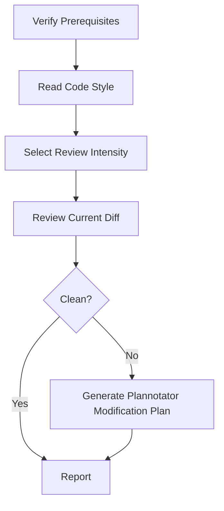

# Review Fix

Review the current changes with auto-selected `review_intensity`, or a forced
`--review-depth quick|standard|deep`. `quick` uses a same-context checklist,
`standard` uses a bounded multi-angle loop, and `deep` uses runtime-aware
reviewer agents across multiple angles. Findings that require edits become a
Plannotator modification plan; this skill does not directly edit files after
review.

## Arguments

Raw arguments: `$ARGUMENTS`

Parse optional `--review-depth quick|standard|deep` first. If present, force
that intensity and record it in the final report. Remaining arguments are
optional additional focus areas for the review (e.g. "concurrency", "error
handling").

## Multi-Agent Review Routing

Before launching review agents, read `../../PRINCIPLES.md` and
`../../WORKFLOW-CONTRACTS.md`. Apply the shared **Review Intensity Selection**,
**Multi-Agent Review Routing**, and **Multi-Round Adversarial Review Loop**
contracts. This workflow is pre-authorized to launch reviewer sub-agents for
selected `standard` and `deep`. Fall back to same-context review only when
reviewer sub-agents are explicitly unsupported by the host/runtime, the user
explicitly forbids them, or the selected reviewer/model is explicitly
unavailable or at capacity. Record `degraded-same-context-review`; degraded
mode still runs the selected intensity's angles and rounds sequentially in the
main context. Selected `quick` same-context review is not degraded.
Also apply the local 12-rule execution contract from `PRINCIPLES.md`: review
findings must trace to changed lines, conflicts must be named instead of
averaged, planned fixes must stay surgical, and skipped checks must be
reported.

## Plannotator Modification Plan Gate

When review finds kept issues that require edits, do not edit files in this
workflow. Write a concrete modification plan, then route it through Plannotator
unless current-conversation approval bypass is active.

Plan path:
- If a repo-local artifact directory exists for the current issue/fix, write
  the plan there as `review-fix-modification-plan.md`.
- Otherwise write `.issue-evaluator/review-fix-modification-plan.md`.

The plan must include:
- Review finding ids, severity, file/line, and source angle.
- Planned edits by file.
- Required tests or verification after applying the plan.
- User-owned decisions or tradeoffs that block a safe edit.
- Out-of-scope findings and dropped nits, with rationale.

Use the available approval path in this order:
1. If current-conversation approval bypass is active, do not run Plannotator.
   Record `bypassed-current-conversation` as the approval source, keep the
   plan artifact, and continue only through the planned edit path.
2. If the `plannotator` CLI is on `PATH`, run
   `plannotator annotate <plan-path> --render-html --gate`.
3. Otherwise, use the runtime's Plannotator planning/visual-explainer workflow
   if available.
4. If Plannotator is unavailable, record `Plannotator unavailable`, leave the
   plan artifact in place, and stop without editing.

Bypass skips approval, not planning. Do not edit before the plan exists and is
recorded.

## Workflow



### Step 1: Verify Prerequisites

1. Determine the code style guide path with `../../WORKFLOW-CONTRACTS.md`
   § Code Style Guide Lifecycle / Storage Path.
2. Check that this file exists. If not, tell the user to run `/evaluate-issue` first to generate the code style analysis.
3. Check that there are uncommitted changes or recent commits representing the fix:
   ```bash
   git diff --shortstat
   git diff --shortstat --cached
   git status --short
   ```
   If there are no changes, warn the user that there is nothing to review.

### Step 2: Read Code Style Guide

Read `<data-dir>/<owner>/<repo>/code-style.md` and extract the key conventions. Summarize the most important rules into a compact checklist (max 15 items) to use as review context. Keep this checklist for use in all review iterations.

### Step 3: Review And Plan

Select `review_intensity` before launching reviewers. Auto-select by risk or
honor `--review-depth quick|standard|deep` as a forced override. Record
`Review intensity: <tier> (<auto|forced>: <reason>)` in the final report.

Repeat the following cycle according to the selected intensity. Track the
iteration count starting at 1.

#### 3a: Multi-Angle Adversarial Review

For `quick`, run one same-context checklist over the angles below. If it finds
issues that require edits, generate a Plannotator modification plan instead of
editing.

For `standard`, run one multi-angle reviewer round. If findings require edits,
generate a Plannotator modification plan. After a user-approved plan is applied
in a separate pass, re-review only affected angles unless the change affects
public contract, security, data flow, or broad scope.

For `deep`, use runtime-aware reviewer agents to inspect the diff from separate
angles. In Claude Code, use independent reviewer agents such as Codex rescue
and native review agents when available; in non-Claude runtimes use the host's
native sub-agent mechanism. Required angles for deep iterations:

- `CORRECTNESS_SECURITY`: bugs, security, regressions, data loss, API breaks
- `STYLE_SCOPE`: repo style, maintainability, surgical scope, drive-by churn
- `TRACEABILITY_TESTS`: issue/comment/focus traceability, test coverage,
  verification gaps

If reviewer sub-agents are explicitly unsupported, forbidden, or at capacity,
run these same three angle prompts sequentially in the main context and record
`degraded-same-context-review`.

Construct the prompt for each angle:

1. Get the current diff (staged + unstaged against the last commit before the fix):
   ```bash
   git diff HEAD
   git diff --cached
   ```
2. Build one adversarial reviewer prompt per angle:
   ```
   Adversarial code review (iteration <N>, angle <ANGLE>). Review the following diff from this assigned angle only:
   - CORRECTNESS_SECURITY: bugs, security issues, regressions, data loss, API breaks.
   - STYLE_SCOPE: repo style violations, maintainability issues, unnecessary abstraction, scope creep, unrelated churn.
   - TRACEABILITY_TESTS: whether the diff traces to the issue/comment/focus, whether tests or verification are missing, whether acceptance evidence is weak.

   IMPORTANT SCOPE RULE: Only report issues within the lines changed in the diff. Do NOT flag lint, style, or formatting issues in unchanged/surrounding code. Even within the diff, only flag style issues if they introduce NEW inconsistencies with the repo's conventions — do not flag pre-existing style patterns that the diff merely touches.

   ## Code Style Rules for This Repo
   <compact style checklist from Step 2>

   ## Additional Focus
   <user's additional focus text if provided>

   ## Assigned Review Angle
   <ANGLE>

   ## Diff to Review
   <the diff output>

   For each issue found, report:
   - Severity (critical / warning / nit)
   - File and line
   - What's wrong and how to fix it
   - Which style rule it violates (if applicable)

   If you find NO issues, respond with exactly: LGTM
   ```

#### 3b: Evaluate Results And Plan

- If **every required angle** returns **LGTM** → exit the loop, proceed to Step 4.
- If any angle reports issues:
  1. Present a brief summary to the user: "Iteration N: found X issues (Y critical, Z warnings, W nits). Generating modification plan..."
  2. **Filter issues before planning**: Only plan issues that are within the
     scope of the current change. Skip any issues that are purely
     lint/style/formatting problems in code that was not changed by the fix.
     Note skipped issues in the summary as "out of scope".
  3. Generate the modification plan using the Plannotator Modification Plan
     Gate. Ensure each planned fix aligns with the code style checklist and
     does not touch unrelated code.
  4. Stop after the plan is generated and its approval status is recorded. A
     later approved modification pass applies the plan.
  5. If the plan is approved in the same conversation, including by
     `bypassed-current-conversation`, apply only the approved plan in the
     modification pass, then run the appropriate review again. For `deep`,
     re-run all required angles after the approved changes land.

#### 3c: Approval Boundary

Do not escalate, accept residual risk, or continue into edits without the
modification plan. Put escalation/accept/stop choices in the plan when they are
user-owned decisions.

### Step 4: Final Holistic Review

After the review exits clean or after the Plannotator modification plan is
generated, run the final review required by the selected intensity. `deep` runs
one final comprehensive review round over the **entire change and plan as a
whole** rather than incremental findings and still preserves the required
angles. `standard` runs the final review only when findings affect public
behavior or cross-file structure. `quick` records residual risk instead of
adding a separate final round.

1. Get the full diff of all changes:
   ```bash
   git diff HEAD
   git diff --cached
   ```
2. Read the modification plan when one exists.
3. Launch reviewer agents for `CORRECTNESS_SECURITY`, `STYLE_SCOPE`, and
   `TRACEABILITY_TESTS` with this prompt:
   ```
   Final holistic code review (angle <ANGLE>). The changes below have completed incremental review. Review the diff and any modification plan as a complete unit from your assigned angle, focusing on:

   1. **Consistency**: Do all the changes work together coherently?
   2. **Completeness**: Are there any missing edge cases, error paths, or tests?
   3. **Architecture**: Do the changes fit well within the existing codebase structure?
   4. **Code style compliance**: Check against the repo's style rules below.
   5. **Unintended side effects**: Could these changes break anything not directly modified?
   6. **Four-principle check** (from the plugin's PRINCIPLES.md):
      - *Think before coding* — any silent assumption embedded in the diff
        that should have been surfaced?
      - *Simplicity first* — any speculative abstraction, unused knob, or
        error handling for impossible states? If 50 lines would do, flag any
        bloat beyond that.
      - *Surgical changes* — every changed line must trace to the issue or
        a specific review finding. Flag drive-by refactors or formatting
        churn in untouched territory.
      - *Goal-driven execution* — is the fix actually verifiable by running
        something (test, repro command, observable behavior)? If only by
        inspection, flag as weak.

   ## Code Style Rules for This Repo
   <compact style checklist>

   ## Additional Focus
   <user's additional focus text if provided>

   ## Full Diff
   <the diff output>

   For each issue found, report:
   - Severity (critical / warning / nit)
   - File and line
   - What's wrong and how to fix it

   If you find NO issues, respond with exactly: LGTM
   ```

4. If any final angle finds issues, add in-scope findings to the modification
   plan. If any angle still has issues after the plan update, present the
   remaining issues to the user.

### Step 5: Report

Present a summary to the user:

```markdown
## Review Complete

- **Iterations**: <N> incremental reviews
- **Review intensity**: <quick|standard|deep> (<auto|forced>: <reason>)
- **Review mode**: <multi-agent | degraded-same-context-review>
- **Degradation reason**: <none | explicit unsupported runtime | user forbade reviewer sub-agents | reviewer/model unavailable or at capacity>
- **Angles per round**: correctness/security, style/scope, traceability/tests
- **Issues found**: <total count>
- **Plannotator modification plan**: <path | not needed | unavailable>
- **Plan approval**: <approved | denied | pending | bypassed-current-conversation | not needed | unavailable>
- **Final holistic review**: Clean / <N remaining issues, by angle>

### Planned Changes
<list of files planned for modification, with one-line descriptions of the planned edit>
```

## Notes

- Always re-read the diff fresh before each review iteration — don't reuse stale diffs.
- Review iterations are clean only when every required angle is clean in the current round.
- When planning fixes, make minimal targeted changes. Don't refactor surrounding code.
- **Scope discipline**: Only plan fixes in code that is part of the current change. Lint/style/formatting issues in unrelated code are out of scope — do not touch them. This keeps diffs clean and avoids unintended regressions.
- If an adversarial-review issue is a false positive or out of scope, skip it and note it in the summary.
- If the user hasn't run `/evaluate-issue` yet but has a code style doc, the review still works.
- Current-conversation bypass skips approval only; it never skips writing the
  modification plan before edits.

## Related Skills

- `$issue-evaluator:evaluate-issue` creates or refreshes the code style guide.
- `$issue-evaluator:fix-issue` applies the issue fix before this review.
- `$issue-evaluator:review-pr` reviews a GitHub PR without editing.
